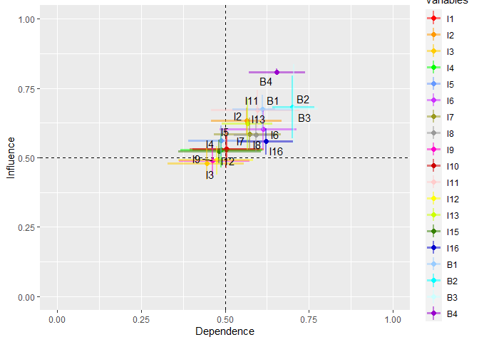

<!-- README.md is generated from README.Rmd. Please edit that file -->

# foRgotten

<!-- badges: start -->
<!-- badges: end -->

## Description

The foRgotten library extends the theory of forgotten effects with the
aggregation of multiple key informants for complete graphs and chain
bipartite graphs. Provides analysis tools for direct effects and
forgotten effects.

The package allows for:

- Calculation of the average incidence by edges for direct effects.
- Calculation of the average incidence per row and column for direct
  effects.
- Calculation of the median betweenness centrality per node for direct
  effects.
- Calculation of the forgotten effects.
- Use of complete graphs and chain bipartite graphs.

## Authors

**Elliott Jamil Mardones Arias**  
School of Computer Science  
Universidad Católica de Temuco  
Rudecindo Ortega 02351  
Temuco, Chile  
<elliott.mardones@uct.cl>

**Julio Rojas-Mora** Department of Computer Science  
Universidad Católica de Temuco  
Rudecindo Ortega 02351 Temuco, Chile  
and Centro de Políticas Públicas  
Universidad Católica de Temuco  
Temuco, Chile  
<julio.rojas@uct.cl>

## Installation

You can install the stable version of foRgotten from CRAN with:

``` r
# install.packages(“foRgotten”)
```

and the development version from GitHub with:

``` r
#install.packages(“devtools”)
#devtools::install_github("ElliottMardones/foRgotten")
```

## Usage

``` r
library(foRgotten)
```

## 

## Functions

The package provides four functions:

``` r
?directEffects
#> starting httpd help server ... done
```

Computes the mean incidence, left one-sided confidence interval, and
p-value with multiple key informants for complete graphs and chained
bipartite graphs. For more details, see help(directEffects).

``` r
?bootMargin
```

Computes the mean incidence for each cause and each effect, confidence
intervals, and p-value with multiple key informants for complete graphs
and chain bipartite graphs. For more details, see help(bootMargin).

``` r
?centrality
```

Performs the computation of median betweenness centrality with multiple
key informants for complete graphs and chain bipartite graphs. For more
details, see help(centrality).

``` r
?FE
```

Performs the forgotten effects calculation proposed by Kaufman and
Gil-Aluja (1988) with multiple experts. The parameters allow you to
specify the significant degree of truth and the order of incidence that
is required to be calculated for chained bipartite graphs For more
details, see help(FE).

## DataSet

The library provides 3 three-dimensional incidence matrices which are
called `CC`, `CE` and `EE`. The data are those used in the study
“Application of the Forgotten Effects Theory For Assessing the Public
Policy on Air Pollution Of the Commune of Valdivia, Chile” developed by
Manna, E. M et al (2018).

The data consists of 16 incentives, 4 behaviors and 10 key informants,
where each of the key informants presented the data with a minimum and
maximum value for each incident. The description of the data can be seen
in Tables 1 and 2 of Manna, E. M et al (2018).

The book store presents the data with the average between the minimum
and maximum value for each incidence, A being the equivalent to
incentives and B to behaviors. For more details of the data you can
consult:

``` r
help(CC)
help(CE)
help(EE)
```

## Examples

### **directEffects()**

The `directEffects()` function calculates the mean incidence, left
one-sided confidence interval, and p-value with multiple key informants
for complete graphs and chain bipartite graphs.

The function contemplates two modalities, the first is focused on
complete graphs and the second for chain bipartite graphs.

#### For complete graphs

To calculate the significant direct effects of the incidence matrix
`CC`, which is described in DataSet, we use the parameter `CE`, which
allows us to enter a three-dimensional matrix, where each sub-matrix
along the z-axis is a rectangular incidence matrix or a list of
data.frame containing rectangular incidence matrices. Each matrix
represents a complete graph. The `CC` and `EE` parameters are used to
perform the calculation with chain bipartite graphs, therefore it is
necessary that these parameters are not used.

To define the degree of truth in which the incidence is considered
significant, the parameter `thr` is used, which is defined between
`[0,1]`. By default `thr = 0.5`.

The `directEffects()` uses the bootstrap method with BCa adjusted boot
and with a left one-sided hypothesis test based on the Z-test. The
`conf.level` parameter defines the confidence level and `reps` the
number of bootstrap replicas. By default `conf.level = 0.95` and
`reps = 10000`.

For example, let `thr = 0.5` and `reps = 1000`, we get:

``` r
result <- directEffects(CE = CC, thr = 0.5, reps = 1000)
```

The function returns a list object with the `$DirectEffects` data subset
that contains the following values:

- From: Origin of the incident
- To: Destination of the incident
- Mean: Average incidence
- UCI: Upper Confidence Interval
- p.value: the calculated p-value

The results obtained correspond to 240 first-order incidents. Equivalent
to the number of edges minus the incidence on itself of each edge. The
first 6 values are:

``` r
head(result$DirectEffects)
#>   From To  Mean    UCI p.value
#> 1   I1 I2 0.525 0.6450   0.638
#> 2   I1 I3 0.450 0.5850   0.263
#> 3   I1 I4 0.525 0.6700   0.611
#> 4   I1 I5 0.465 0.6450   0.379
#> 5   I1 I6 0.645 0.7792   0.874
#> 6   I1 I7 0.815 0.8750   1.000
```

If any of the occurrences have `"NA"` and `"NaN"` values in the UCI and
p.value fields, it indicates that the values for that occurrence have
repeated values. This prevents bootstrapping.

The `delete` parameter allows assigning zeros to edges whose incidences
are significantly less than `thr` to the p-value set in the `conf.level`
parameter. Also, this allows you to remove non-significant results from
the `$DirectEffects` subset.

For example, let `thr = 0.5` and `conf.level = 0.95`, mean incidences
less than `0.5` or incidents with p.value less than `1 - conf.level`
will be eliminated.

``` r
result <- directEffects(CE = CC, thr = 0.5, reps = 1000, delete = TRUE)
#> deleting data...
```

The function reports by console when significant edges have been
removed. The number of significant direct effects decreased from 240 to
205 for `delete = TRUE`.

**Note:** However, this does not guarantee that a non-significant
variable in 1st order does not generate 2nd order effects, since they
are extracted from the empirical distribution of the key informants.

For `delete = TRUE`, the function returns `$Data`, the three-dimensional
matrix entered in the `CE` parameter but assigning 0 to the
non-significant edges.

#### For chain bipartite graphs

To calculate the significant direct effects of the incidence matrices
`CC`, `CE` and `EE`, which are described in DataSet, we make use of the
already described parameter `CE`. The `EE` parameter is equivalent to
the `CC` parameter. The `CC` parameter allows us to enter a
three-dimensional matrix, where each submatrix along the z-axis is a
square incidence matrix and reflective, or a list of data.frame
containing square and reflective incidence matrices. Each matrix
represents a bipartite graph.

For example, let `thr = 0.5` and `reps = 1000`, you get:

``` r
result <- directEffects(CC = CC, CE = CE, EE = EE, reps = 1000)
```

The results obtained correspond to 312 first-order incidents. Using the
`delete = TRUE` parameter, the number of first-order significant
occurrences was reduced to 271.

For `delete = TRUE`, the function returns `$CC`, `$CE`, and `$EE`, which
are the three-dimensional matrices entered in the parameters `CC`, `CE`,
and `EE`, but assigning 0 to the non-significant edges.

### bootMargin()

The `bootMargin()` function calculates the mean incidence of each cause
and each effect, confidence intervals, and p-value with multiple experts
for complete graphs and chain bipartite graphs.

The function contemplates two modalities, the first is focused on
complete graphs and the second for chain bipartite graphs.

#### **For complete graphs**

To calculate the average incidence of each cause and each effect of the
`CC` incidence matrix, which is described in DataSet, we use the `CE`
parameter, which allows us to enter a three-dimensional matrix, where
each sub-matrix along the z-axis is a rectangular incidence matrix or a
list of data.frame containing rectangular incidence matrices. The `CC`
and `EE` parameters are used to perform the calculation with chain
bipartite graphs, therefore it is necessary that these parameters are
not used.

To define the degree of truth in which the incidence is considered
significant, the parameter `thr` is used, which is defined between
`[0,1]`. By default `thr = 0.5`.

The `bootMargin()` uses the bootstrap method with BCa adjusted boot and
with a left one-sided hypothesis test based on the Z-test. The
`conf.level` parameter defines the confidence level and `reps` the
number of bootstrap replicas. By default `conf.level = 0.95` and
`reps = 10000`.

For example, let `thr = 0.6` and `reps = 1000` we get:

``` r
result <- bootMargin(CE = CC, thr.cause = 0.6,thr.effect =  0.6, reps = 1000)
```

The function returns a list object with the data subsets `$byCause` and
`$byEffect`, each of these subsets of data contains the following
values:

- Var: Variable name
- Mean: Calculated mean.
- LCI: Lower Confidence Interval
- ICU: Upper Confidence Interval
- p.value: the calculated p-value.

The `bootMargin()` function allows you to analyze by node or by
variable. The results obtained are:

For `$byCause`

``` r
result$byCause
#>    Var      Mean    LCI    UCI  p.value
#> 1   I1 0.5255287 0.4697 0.5942 3.61e-02
#> 2   I2 0.6002383 0.5513 0.6515 9.87e-01
#> 3   I3 0.4281847 0.3605 0.4741 6.16e-05
#> 4   I4 0.4905817 0.4015 0.5426 3.87e-05
#> 5   I5 0.5348783 0.4706 0.5980 4.40e-02
#> 6   I6 0.5518723 0.4791 0.6137 1.50e-01
#> 7   I7 0.5327707 0.4780 0.5793 7.18e-03
#> 8   I8 0.5442003 0.4694 0.6144 1.28e-01
#> 9   I9 0.4651837 0.3984 0.5195 2.88e-04
#> 10 I10 0.4730747 0.3921 0.5433 3.57e-04
#> 11 I11 0.5974920 0.5483 0.6440 9.03e-01
#> 12 I12 0.4559987 0.3849 0.4981 5.03e-05
#> 13 I13 0.5546480 0.4688 0.6390 2.73e-01
#> 14 I14 0.2517183 0.2068 0.2892 4.63e-04
#> 15 I15 0.4436233 0.3902 0.4966 1.34e-03
#> 16 I16 0.5146507 0.4549 0.5623 1.33e-03
```

For `$byEffect`

``` r
result$byEffect
#>    Var      Mean    LCI    UCI  p.value
#> 1   I1 0.4829240 0.3619 0.5694 0.005580
#> 2   I2 0.5528630 0.4340 0.6567 0.418000
#> 3   I3 0.4212187 0.3193 0.5127 0.000581
#> 4   I4 0.4703040 0.3515 0.5820 0.028100
#> 5   I5 0.4625380 0.3654 0.5481 0.000342
#> 6   I6 0.5879940 0.4192 0.6669 0.767000
#> 7   I7 0.5570840 0.4468 0.6543 0.393000
#> 8   I8 0.5737570 0.5113 0.6364 0.417000
#> 9   I9 0.4493960 0.3497 0.5506 0.007640
#> 10 I10 0.4673950 0.3486 0.5697 0.011000
#> 11 I11 0.5782013 0.4257 0.6933 0.698000
#> 12 I12 0.4517060 0.3310 0.5653 0.012100
#> 13 I13 0.5623403 0.4780 0.6340 0.314000
#> 14 I14 0.2712527 0.1924 0.3419 0.000540
#> 15 I15 0.4740827 0.3548 0.5986 0.050400
#> 16 I16 0.5930367 0.5160 0.6869 0.889000
```

The function allows eliminating causes and effects whose average
incidence is not significant at the set `thr` parameter. For example,
for `delete = TRUE`, the number of significant variables decreased.

``` r
result <- bootMargin(CE = CC, thr.cause = 0.6,thr.effect =  0.6, reps = 1000, delete = TRUE)
```

For `$byCause`

``` r
result$byCause
#>    Var      Mean    LCI    UCI  p.value
#> 2   I2 0.6014263 0.5464 0.6502 0.936000
#> 5   I5 0.5339813 0.4761 0.6027 0.060900
#> 6   I6 0.5537160 0.4683 0.6144 0.136000
#> 7   I7 0.5326043 0.4803 0.5825 0.003470
#> 8   I8 0.5433427 0.4740 0.6101 0.124000
#> 11 I11 0.5961203 0.5490 0.6423 0.908000
#> 13 I13 0.5558097 0.4603 0.6335 0.244000
#> 16 I16 0.5129103 0.4587 0.5657 0.000672
```

For `$byEffect`

``` r
result$byEffect
#>    Var      Mean    LCI    UCI  p.value
#> 2   I2 0.5556797 0.4360 0.6650 0.467000
#> 5   I5 0.4605667 0.3641 0.5503 0.000412
#> 6   I6 0.5880637 0.4116 0.6719 0.755000
#> 7   I7 0.5602973 0.4352 0.6537 0.370000
#> 8   I8 0.5743857 0.5108 0.6411 0.480000
#> 11 I11 0.5779540 0.4339 0.6987 0.739000
#> 13 I13 0.5612940 0.4806 0.6367 0.368000
#> 16 I16 0.5946807 0.5170 0.6820 0.823000
```

For `delete = TRUE`, the function returns`$Data`, the matrix entered in
the `CC`parameter, but with the non-significant rows and columns
removed.

For `plot = TRUE`, the function returns `$plot`, which contains the
graph generated from the subsets `$byCause` and `$byEffect`. On the
x-axis are the “Dependence” associated with `$byEffect` and on the
y-axis the “Influence” is associated with `$byCause`.

``` r
result <- bootMargin(CE = CC, thr.cause = 0.6,thr.effect =  0.6, reps = 1000, delete = TRUE, plot = TRUE)
result$plot
```



#### **For chain bipartite graphs**

To calculate the average incidence of each cause and each effect of the
incidence matrices `CC`, `CE`and `EE`, which are described in DataSet,
we make use of parameter `CC`. The `EE`parameter is equivalent to the
`CC`parameter. The `CC` parameter allows us to enter a three-dimensional
matrix, where each submatrix along the z-axis is a square incidence
matrix and reflective, or a list of data.frame containing square and
reflective incidence matrices. Each matrix represents a bipartite graph.

For example, let `thr = 0.5` and `reps = 1000`, you get:

``` r
result <- bootMargin(CC = CC, CE = CE, EE = EE, thr.cause = 0.6,thr.effect =  0.6, reps = 1000)
```

The results obtained correspond to all the nodes or variables found in
the entered matrices.

The results for `$byCause` and `$byEffect` are:

For `$byCause`

``` r
result$byCause
#>    Var      Mean    LCI    UCI  p.value
#> 1   I1 0.5138184 0.4716 0.5657 0.002590
#> 2   I2 0.6290413 0.5779 0.6758 0.293000
#> 3   I3 0.4574263 0.3898 0.5155 0.000886
#> 4   I4 0.5113989 0.4486 0.5738 0.004470
#> 5   I5 0.5485313 0.4916 0.6037 0.069300
#> 6   I6 0.5837542 0.5037 0.6477 0.567000
#> 7   I7 0.5725079 0.5184 0.6250 0.321000
#> 8   I8 0.5718976 0.5003 0.6347 0.420000
#> 9   I9 0.4792224 0.4171 0.5411 0.000946
#> 10 I10 0.5159608 0.4481 0.5955 0.040100
#> 11 I11 0.6543305 0.5973 0.7194 0.066500
#> 12 I12 0.4779711 0.4204 0.5325 0.000895
#> 13 I13 0.6248876 0.5376 0.7161 0.550000
#> 14 I14 0.2432737 0.2034 0.2842 0.001520
#> 15 I15 0.4610389 0.4103 0.5029 0.000574
#> 16 I16 0.5272011 0.4756 0.5732 0.001660
#> 17  B1 0.6777600 0.6000 0.7200 0.251000
#> 18  B2 0.6789750 0.5700 0.7550 0.165000
#> 19  B3 0.6760650 0.5500 0.8350 0.516000
#> 20  B4 0.8081917 0.8000 0.8150 0.000549
```

For `$byEffect`

``` r
result$byEffect
#>    Var      Mean    LCI    UCI  p.value
#> 1   I1 0.4790843 0.3372 0.5650 0.004330
#> 2   I2 0.5538657 0.4312 0.6629 0.444000
#> 3   I3 0.4170893 0.3181 0.5173 0.000906
#> 4   I4 0.4662883 0.3481 0.5826 0.025100
#> 5   I5 0.4621073 0.3563 0.5398 0.000991
#> 6   I6 0.5931100 0.4369 0.6643 0.695000
#> 7   I7 0.5570380 0.4363 0.6516 0.428000
#> 8   I8 0.5740620 0.5120 0.6427 0.426000
#> 9   I9 0.4489570 0.3457 0.5475 0.001160
#> 10 I10 0.4684953 0.3483 0.5650 0.005000
#> 11 I11 0.5779897 0.4241 0.6972 0.735000
#> 12 I12 0.4560340 0.3290 0.5642 0.007530
#> 13 I13 0.5613497 0.4774 0.6302 0.273000
#> 14 I14 0.2709297 0.1977 0.3431 0.000388
#> 15 I15 0.4761653 0.3357 0.5903 0.030100
#> 16 I16 0.5900730 0.5163 0.6951 0.968000
#> 17  B1 0.5424803 0.4508 0.6506 0.329000
#> 18  B2 0.6753503 0.6095 0.7609 0.022900
#> 19  B3 0.6915418 0.6366 0.7693 0.000457
#> 20  B4 0.6277853 0.5378 0.7324 0.611000
```

For `delete = TRUE`, the function returns `$CC`, `$CE`, and `$EE`, which
are the three-dimensional arrays entered in the `CC`, `CE`, and `EE`
parameters, but with the rows and columns removed.

For `plot = TRUE`, the function returns `$plot`, which contains the
graph generated from the subsets `$byCause` and `$byEffect`. On the
x-axis are the “Dependence” associated with `$byEffect` and on the
y-axis the “Influence” is associated with `$byCause`.

### centrality()

The `centrality()` function calculates the median betweenness
centrality, confidence intervals, and the selected method for
calculating the centrality distribution for complete graphs and chain
bipartite graphs.

The function contemplates two modalities, the first is focused on
complete graphs and the second for chain bipartite graphs.

#### For complete graphs

To calculate the median betweenness centrality of the incidence matrix
`CC`, which is described in DataSet, we use the parameter `CC`, which
allows us to enter a three-dimensional matrix, where each submatrix
along the z-axis is a square incidence matrix and reflective, or a list
of data.frame containing square and reflective incidence matrices. Each
matrix represents a complete graph. The `CE`and `EE`parameters are used
to perform the calculation with chain bipartite graphs, therefore it is
necessary that these parameters are not used.

The `centrality()` function makes use of the `“boot”` function from the
boot package (Canty A, Ripley BD, 2021) to implement the bootstrap
method with BCa tight boot. The number of bootstrap replicas is defined
in the `reps`parameter. By default `reps = 10000`.

The model parameter allows bootstrapping with some of the following
statistics: mediate.

- `median`.
- `conpl`: Calculate the median of a power distribution according to
  Newman M.E (2005).
- `conlnorm`: Calculates the median of a power distribution according to
  Gillespie CS (2015).

The objective of the model parameter is to determine to which
heavy-tailed distribution the variables or nodes of the entered
parameter correspond.

For example, let `model = "median"` and `reps = 300`, we will obtain:

``` r
result <- centrality(CE = CC, model = "median", reps = 300)
#> Warning in norm.inter(t, adj.alpha): extreme order statistics used as endpoints

#> Warning in norm.inter(t, adj.alpha): extreme order statistics used as endpoints

#> Warning in norm.inter(t, adj.alpha): extreme order statistics used as endpoints
```

The returned object of type data.frame contains the following
components:

- Var: Name of the variable.
- Median: Median calculated.
- LCI: Lower Confidence Interval.
- ICU: Upper Confidence Interval.
- Method: Statistical method used associated with the model parameter.

If the median calculated for any of the betweenness centrality has a
median equal to 0, the LCI and UCI fields will have a value equal to 0.
This is reported with a warning per console.

The results are:

``` r
result
#>    Var    Median       LCI      UCI                  Method pValue
#> 1   I1 20.000000 7.1666667 41.50000                  median     NA
#> 2   I2 14.500000 1.8487452 24.77778                  median     NA
#> 3   I3  6.851190 0.3250000 12.58333                  median     NA
#> 4   I4  2.079167 0.8333333 21.58333                  median     NA
#> 5   I5  7.833333 0.3250000  9.00000                  median     NA
#> 6   I6 28.391667 8.3380952 36.83333                  median     NA
#> 7   I7 11.500000 2.0000000 41.33333                  median     NA
#> 8   I8  7.416667 2.1666667 17.00038                  median     NA
#> 9   I9  5.200000 3.1500000 13.50000                  median     NA
#> 10 I10  4.250000 1.5000000 12.00000                  median     NA
#> 11 I11 22.000000 2.0776879 30.75000                  median     NA
#> 12 I12 12.516667 0.5000000 15.36667                  median     NA
#> 13 I13  6.208333 2.0000000 13.63885                  median     NA
#> 14 I14  0.000000 0.0000000  0.00000 median length(col) == 0     NA
#> 15 I15  6.958333 2.1587356 51.60417                  median     NA
#> 16 I16 16.166667 8.5769841 43.85417                  median     NA
```

Now if we use `"conpl"` in the model parameter and 300 bootstrap
replicas, we get:

``` r
result <- centrality(CE = CC, model = "conpl", reps = 300)
#> Warning in norm.inter(t, adj.alpha): extreme order statistics used as endpoints
#> Expected total run time for 300 sims, using 1 threads is 2.83 seconds.
#> Warning in norm.inter(t, adj.alpha): extreme order statistics used as endpoints
#> Expected total run time for 300 sims, using 1 threads is 3.78 seconds.
#> Warning in min(which(internal[["dat"]] >= (x - .Machine$double.eps^0.5))):
#> ningún argumento finito para min; retornando Inf
#> Warning in min(which(internal[["dat"]] >= (x - .Machine$double.eps^0.5))):
#> ningún argumento finito para min; retornando Inf
#> Warning in norm.inter(t, adj.alpha): extreme order statistics used as endpoints
#> Expected total run time for 300 sims, using 1 threads is 4.29 seconds.
#> Warning in norm.inter(t, adj.alpha): extreme order statistics used as endpoints
#> Expected total run time for 300 sims, using 1 threads is 4.93 seconds.
#> Warning in norm.inter(t, adj.alpha): extreme order statistics used as endpoints
#> Expected total run time for 300 sims, using 1 threads is 3.76 seconds.
#> Warning in norm.inter(t, adj.alpha): extreme order statistics used as endpoints
#> Expected total run time for 300 sims, using 1 threads is 4.01 seconds.
#> Warning in min(which(internal[["dat"]] >= (x - .Machine$double.eps^0.5))):
#> ningún argumento finito para min; retornando Inf

#> Warning in min(which(internal[["dat"]] >= (x - .Machine$double.eps^0.5))):
#> extreme order statistics used as endpoints
#> Warning in min(which(internal[["dat"]] >= (x - .Machine$double.eps^0.5))):
#> ningún argumento finito para min; retornando Inf
#> Warning in norm.inter(t, adj.alpha): extreme order statistics used as endpoints
#> Expected total run time for 300 sims, using 1 threads is 4.55 seconds.
#> Warning in min(which(internal[["dat"]] >= (x - .Machine$double.eps^0.5))):
#> ningún argumento finito para min; retornando Inf

#> Warning in min(which(internal[["dat"]] >= (x - .Machine$double.eps^0.5))):
#> extreme order statistics used as endpoints

#> Warning in min(which(internal[["dat"]] >= (x - .Machine$double.eps^0.5))):
#> extreme order statistics used as endpoints
#> Expected total run time for 300 sims, using 1 threads is 3.19 seconds.
#> Warning in min(which(internal[["dat"]] >= (x - .Machine$double.eps^0.5))):
#> ningún argumento finito para min; retornando Inf
#> Expected total run time for 300 sims, using 1 threads is 3.44 seconds.
#> Warning in rm(ofuss, envir = ofuss): objeto 'ofuss' no encontrado
result
#>    Var    Median       LCI       UCI Method    pValue
#> 1   I1 11.597195 5.0949657 15.678441  conpl 0.8833333
#> 2   I2 13.355431 8.0479400 15.145864  conpl 0.6700000
#> 3   I3  6.851190 0.3250000 12.583333 median        NA
#> 4   I4  2.079167 0.8333333 21.583333 median        NA
#> 5   I5  4.389108 0.2699764  4.691944  conpl 0.3066667
#> 6   I6 17.332694 6.0968498 21.683515  conpl 0.3300000
#> 7   I7 22.541688 6.9957387 23.138874  conpl 0.7300000
#> 8   I8  6.283605 3.5034401  7.024476  conpl 0.5766667
#> 9   I9  5.200000 3.1500000 13.500000 median        NA
#> 10 I10  4.250000 1.2500000 27.345238 median        NA
#> 11 I11 13.228170 3.1363356 18.153399  conpl 0.5166667
#> 12 I12 12.516667 0.5000000 15.366667 median        NA
#> 13 I13  3.594232 2.2708257  6.457101  conpl 0.7133333
#> 14 I14  0.000000 0.0000000  0.000000 median        NA
#> 15 I15  6.958333 2.0000000 43.000000 median        NA
#> 16 I16  6.081368 3.5349256 12.712486  conpl 0.8700000
```

**Note:** If the calculation cannot be performed with `model = "conpl"`
in some node, the function will perform the calculation with `"median"`.
This change is indicated in the Method field.

**Note:** If the calculation cannot be performed with
`model = "conlnorm"` in some node, the function will perform the
calculation with “median”. This change is indicated in the Method field

**IMPORTANT:** The best statistic to use in the model parameter will
depend on the data and the number of bootstrap replicas that you deem
appropriate.

The `centrality()` function implements the parallel function from the
boot package. The `parallel`parameter allows you to set the type of
parallel operation that is required. The options are `"multicore"`,
`"snow"` and `"no"`. By default `parallel = "no"`. The number of
processors to be used in the paralell implementation is defined in the
`ncpus`parameter. By default `ncpus = 1`.

The `parallel`and `ncpus`options are not available on Windows operating
systems.

**For chain bipartite graphs**

To calculate the median betweenness centrality of the incidence matrices
`AA`, `AB`and `BB`, which are described in DataSet, we make use of the
already described parameter `CC`. The `EE`parameter is equivalent to the
`CC`parameter. The `CE`parameter allows you to enter a three-dimensional
matrix, where each sub-matrix along the z-axis is a rectangular
incidence matrix, or a list of data.frame containing rectangular
incidence matrices. Each matrix represents a bipartite graph.

For example, let `model = "conpl"` and `reps = 300`, you get:

``` r
result <- centrality(CC = CC, CE = CE, EE = EE, model = "conpl", reps = 300)
#> Warning in norm.inter(t, adj.alpha): extreme order statistics used as endpoints
#> Expected total run time for 300 sims, using 1 threads is 3 seconds.
#> Warning in norm.inter(t, adj.alpha): extreme order statistics used as endpoints
#> Expected total run time for 300 sims, using 1 threads is 4.49 seconds.
#> Warning in min(which(internal[["dat"]] >= (x - .Machine$double.eps^0.5))):
#> ningún argumento finito para min; retornando Inf
#> Warning in min(which(internal[["dat"]] >= (x - .Machine$double.eps^0.5))):
#> ningún argumento finito para min; retornando Inf
#> Warning in norm.inter(t, adj.alpha): extreme order statistics used as endpoints
#> Expected total run time for 300 sims, using 1 threads is 3.74 seconds.
#> Expected total run time for 300 sims, using 1 threads is 4.48 seconds.
#> Warning in norm.inter(t, adj.alpha): extreme order statistics used as endpoints
#> Expected total run time for 300 sims, using 1 threads is 4.73 seconds.
#> Warning in norm.inter(t, adj.alpha): extreme order statistics used as endpoints
#> Expected total run time for 300 sims, using 1 threads is 3.66 seconds.
#> Warning in min(which(internal[["dat"]] >= (x - .Machine$double.eps^0.5))):
#> ningún argumento finito para min; retornando Inf

#> Warning in min(which(internal[["dat"]] >= (x - .Machine$double.eps^0.5))):
#> extreme order statistics used as endpoints
#> Expected total run time for 300 sims, using 1 threads is 5.1 seconds.
#> Warning in norm.inter(t, adj.alpha): extreme order statistics used as endpoints
#> Expected total run time for 300 sims, using 1 threads is 5.1 seconds.
#> Warning in norm.inter(t, adj.alpha): extreme order statistics used as endpoints
#> Expected total run time for 300 sims, using 1 threads is 3.47 seconds.
#> Expected total run time for 300 sims, using 1 threads is 3.8 seconds.
#> Warning in min(which(internal[["dat"]] >= (x - .Machine$double.eps^0.5))):
#> ningún argumento finito para min; retornando Inf
#> Expected total run time for 300 sims, using 1 threads is 3.21 seconds.
#> Warning in min(which(internal[["dat"]] >= (x - .Machine$double.eps^0.5))):
#> ningún argumento finito para min; retornando Inf
#> Expected total run time for 300 sims, using 1 threads is 3.27 seconds.
#> Warning in norm.inter(t, adj.alpha): extreme order statistics used as endpoints
#> Expected total run time for 300 sims, using 1 threads is 3.66 seconds.
#> Warning in min(which(internal[["dat"]] >= (x - .Machine$double.eps^0.5))):
#> ningún argumento finito para min; retornando Inf
#> Warning in rm(ofuss, envir = ofuss): objeto 'ofuss' no encontrado
result
#>    Var    Median        LCI       UCI Method    pValue
#> 1   I1 13.450654  5.0735655 20.856674  conpl 0.9333333
#> 2   I2 14.588469  7.0820082 16.751646  conpl 0.6633333
#> 3   I3  8.267857  1.8750000 14.100000 median        NA
#> 4   I4  1.208333  0.5833333 15.351723 median        NA
#> 5   I5  4.978344  0.7803381  5.896264  conpl 0.2466667
#> 6   I6 13.508932  5.5183654 31.844477  conpl 0.2266667
#> 7   I7 24.987813  9.8643938 25.608045  conpl 0.6466667
#> 8   I8  5.048619  2.6785602 10.139204  conpl 0.8100000
#> 9   I9  3.575000  0.3750000  9.350000 median        NA
#> 10 I10  1.295458  1.1503219  8.457516  conpl 0.2033333
#> 11 I11 21.181762 17.1158712 21.678727  conpl 0.5700000
#> 12 I12  7.288716  3.1561816  7.670297  conpl 0.6700000
#> 13 I13  2.007641  0.4688817  8.674508  conpl 0.4233333
#> 14 I14  0.000000  0.0000000  0.000000 median        NA
#> 15 I15  7.250000  2.0000000 24.894048 median        NA
#> 16 I16  9.909888  3.6132315 13.061451  conpl 0.7266667
#> 17  B1  2.750000  2.5000000  7.800000 median        NA
#> 18  B2  1.361903  0.7043689  2.520377  conpl 0.7700000
#> 19  B3  1.786741  1.7559349  1.808801  conpl 0.7233333
#> 20  B4  6.433333  1.8666667 11.600000 median        NA
```

The `centrality()` function implements the parallel function from the
`boot`package. The `parallel`parameter allows you to set the type of
parallel operation that is required. The options are `"multicore"`,
`"snow"` and `"no"`. By default `parallel = "no"`. The number of
processors to be used in the `paralell`implementation is defined in the
`ncpus`parameter. By default `ncpus = 1`.

The `parallel`and `ncpus`options are not available on Windows operating
systems.

### fe.sq()

The function `fe.sq()`, calculates the forgotten effects (Kaufmann & Gil
Aluja, 1988) with multiple experts for complete graphs, with calculation
of the frequency of appearance of the forgotten effects, mean incidence,
confidence intervals and standard error

For example, to perform the calculation using the incidence matrix `AA`,
described in DATASET, we use the parameter `CC`, which allows us to
enter a three-dimensional matrix, where each sub-matrix along the z axis
is a square and reflective incidence matrix , or a list of data.frame
containing square and reflective incidence matrices. Each matrix
represents a complete graph.

To define the degree of truth in which the incidence is considered
significant, the parameter `thr`is used, which is defined between
`[0,1]`. By default `thr = 0.5`.

To define the maximum order of the forgotten effects, use the
`maxOrder`parameter. By default `maxOrder = 2`.

The `fe.sq()` function makes use of the `“boot”` function from the boot
package (Canty A, Ripley BD, 2021) to implement bootstrap with BCa tight
boot. The number of bootstrap replicas is defined in the `reps`
parameter. By default `reps = 10000`.

For example, let `thr = 0.5`, `maxOrder = 3` and `reps = 1000`, you get:

The returned object of type list contains two subsets of data. The
`$boot` data subset is a list of data.frame where each data.frame
represents the order of the calculated forgotten effect, the components
are:

- From: Indicates the origin of the forgotten effects relationships.
- Through_x: Dynamic field that represents the intermediate
  relationships of the forgotten effects. For example, for order n there
  will be “though_1” up to “though\_ \<n-1\>”.
- To: Indicates the end of the forgotten effects relationships.
- Count: Number of times the forgotten effect was repeated.
- Mean: Mean effect of the forgotten effect
- LCI: Lower Confidence Intervals.
- UCI: Upper Confidence Intervals.
- SE: Standard error.

The `$byExperts` data subset is a list of `data.frame` where each
`data.frame` represents the order of the forgotten effect calculated
with its associated incidence value for each expert, the components are:

- From: Indicates the origin of the forgotten effects relationships.
- Through_x: Dynamic field that represents the intermediate
  relationships of the forgotten effects. For example, for order n there
  will be “though_1” up to “though\_ \<n-1\>”.
- To: Indicates the end of the forgotten effects relationships.
- Count: Number of times the forgotten effect was repeated.
- Expert_x: Dynamic field that represents each of the entered experts.
- 

If we look at the data in the `$boot$Order_2` data subset, we find 706
2nd order effects and 611 of these effects are unique. The first 6 are:

``` r
head(result$boot$Order_2)
#> NULL
```

The relations I8 -\> I11 -\> I10 appeared 4 times. To know exactly in
which expert these relationships were found, there is the `$byExperts`
data subset. If we look at the first row of `$byExperts$order_2` we can
identify the experts who provided this information.

``` r
head(result$byExperts$Order_2)
#> NULL
```

**IMPORTANT**: If any of the `$boot` values shows `"NA"` in LCI, UCI and
SE, it indicates that the values of the incidents per expert are the
same or the value is unique. That prevents implementing bootstrap.

The `fe.sq()` function implements the parallel function from the boot
package. The parallel parameter allows you to set the type of parallel
operation that is required. The options are `"multicore"`, `"snow"` and
`"no"`. By default `parallel = "no"`. The number of processors to be
used in the `paralell`implementation is defined in the `ncpus`parameter.
By default `ncpus = 1`.

The `parallel` and `ncpus`options are not available on Windows operating
systems.

### fe.rect()

The function `fe.rect()`, calculates the forgotten effects (Kaufmann &
Gil Aluja, 1988) with multiple key informants for chain bipartite
graphs, with calculation of the frequency of appearance of the forgotten
effects, mean incidence, confidence intervals and standard error.

To perform the calculation using the incidence matrices `AA`, `AB`and
`BB`, which are described in DataSet, we make use of the already
described parameter `CC`. The `EE` parameter is equivalent to the `CC`
parameter. The `CE` parameter allows you to enter a three-dimensional
matrix, where each sub-matrix along the z-axis is a rectangular
incidence matrix, or a list of data.frame containing rectangular
incidence matrices. Each matrix represents a bipartite graph.

To define the degree of truth in which the incidence is considered
significant, the parameter `thr` is used, which is defined between
`[0,1]`. By default `thr = 0.5`.

To define the maximum order of the forgotten effects, use the
`maxOrder`parameter. By default `maxOrder = 2`.

The `fe.rect()` function makes use of the `“boot”` function from the
boot package (Canty A, Ripley BD, 2021) to implement bootstrap with BCa
tight boot.. The number of bootstrap replicas is defined in the `reps`
parameter. By default `reps = 10000`.

For example, let `thr = 0.5`, `maxOrder = 3` and `reps = 1000`, you get:

**MPORTANT:** If any of the `$boot` values shows `"NA"` in LCI, UCI and
SE, it indicates that the values of the incidents per expert are the
same or the value is unique. That prevents implementing bootstrap.

The `fe.sq()` function implements the parallel function from the boot
package. The `parallel`parameter allows you to set the type of parallel
operation that is required. The options are `"multicore"`, `"snow"` and
`"no"`. By default `parallel = "no"`. The number of processors to be
used in the `paralell` implementation is defined in the `ncpus`
parameter. By default `ncpus = 1`.

The `parallel` and `ncpus` options are not available on Windows
operating systems.

## References

1.  Kaufmann, A., & Gil Aluja, J. (1988). Modelos para la Investigación
    de efectos olvidados, Milladoiro. Santiago de Compostela, España.

2.  Manna, E. M., Rojas-Mora, J., & Mondaca-Marino, C. (2018).
    Application of the Forgotten Effects Theory for Assessing the Public
    Policy on Air Pollution of the Commune of Valdivia, Chile. In From
    Science to Society (pp. 61-72). Springer, Cham.

3.  Freeman, L.C. (1979). Centrality in Social Networks I: Conceptual
    Clarification. Social Networks, 1, 215-239.

4.  Ulrik Brandes, A Faster Algorithm for Betweenness Centrality.
    Journal of Mathematical Sociology 25(2):163-177, 2001.

5.  Canty A, Ripley BD (2021). boot: Bootstrap R (S-Plus) Functions. R
    package version 1.3-28.

6.  Davison AC, Hinkley DV (1997). Bootstrap Methods and Their
    Applications. Cambridge University Press, Cambridge. ISBN
    0-521-57391-2, <http://statwww.epfl.ch/davison/BMA/>.

7.  Newman, M. E. (2005). Power laws, Pareto distributions and Zipf’s
    law. Contemporary physics, 46(5), 323-351.

8.  Gillespie, C. S. (2014). Fitting heavy tailed distributions: the
    poweRlaw package. arXiv preprint arXiv:1407.3492.

9.  <https://cran.r-project.org/web/packages/wBoot/index.html>
