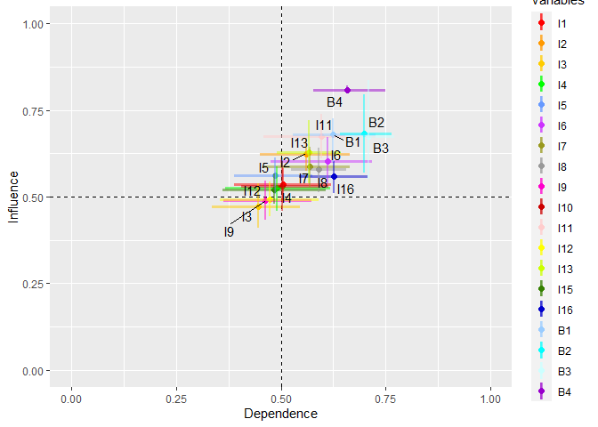

<!-- README.md is generated from README.Rmd. Please edit that file -->

# foRgotten

<!-- badges: start -->
<!-- badges: end -->

## Description

The foRgotten library extends the theory of forgotten effects with the
aggregation of multiple key informants for complete graphs and chain
bipartite graphs. Provides analysis tools for direct effects and
forgotten effects.

The package allows for:

-   Calculation of the average incidence by edges for direct effects.
-   Calculation of the average incidence per row and column for direct
    effects.
-   Calculation of the median betweenness centrality per node for direct
    effects.
-   Calculation of the forgotten effects.
-   Use of complete graphs and chain bipartite graphs.

## Authors

**Elliott Jamil Mardones Arias** School of Computer Science Universidad
Católica de Temuco Rudecindo Ortega 02351 Temuco, Chile
<elliott.mardones@uct.cl>

**Julio Rojas-Mora** Department of Computer Science Universidad Católica
de Temuco Rudecindo Ortega 02351 Temuco, Chile and Centro de Políticas
Públicas Universidad Católica de Temuco Temuco, Chile
<julio.rojas@uct.cl>

## Installation

You can install the stable version of foRgotten from CRAN with:

``` r
# install.packages(“foRgotten”)
```

and the development version from GitHub with:

``` r
#install.packages(“devtools”)
#devtools::install_github("ElliottMardones/foRgotten")
```

## Usage

``` r
library(foRgotten)
```

## 

## Functions

The package provides four functions:

``` r
?directEffects
#> starting httpd help server ... done
```

Computes the mean incidence, left one-sided confidence interval, and
p-value with multiple key informants for complete graphs and chained
bipartite graphs. For more details, see help (de.sq).

``` r
?bootMargin
```

Computes the mean incidence for each cause and each effect, confidence
intervals, and p-value with multiple key informants for complete graphs
and chain bipartite graphs. For more details, see help(bootMargin).

``` r
?centrality
```

Performs the computation of median betweenness centrality with multiple
key informants for complete graphs and chain bipartite graphs. For more
details, see help(centrality).

``` r
?FE
```

Performs the forgotten effects calculation proposed by Kaufman and
Gil-Aluja (1988) with multiple experts. The parameters allow you to
specify the significant degree of truth and the order of incidence that
is required to be calculated for chained bipartite graphs For more
details, see help(FE).

## DataSet

The library provides 3 three-dimensional incidence matrices which are
called `CC`, `CE` and `EE`. The data are those used in the study
“Application of the Forgotten Effects Theory For Assessing the Public
Policy on Air Pollution Of the Commune of Valdivia, Chile” developed by
Manna, E. M et al (2018).

The data consists of 16 incentives, 4 behaviors and 10 key informants,
where each of the key informants presented the data with a minimum and
maximum value for each incident. The description of the data can be seen
in Tables 1 and 2 of Manna, E. M et al (2018).

The book store presents the data with the average between the minimum
and maximum value for each incidence, A being the equivalent to
incentives and B to behaviors. For more details of the data you can
consult:

``` r
help(CC)
help(CE)
help(EE)
```

## Examples

### **directEffects()**

The `directEffects()` function calculates the mean incidence, left-sided
confidence interval, and p-value for complete graphs and chained
bipartite graphs using multiple key informants. This function uses the
bootstrap method with adjusted BCa and a left-sided hypothesis test
based on the t-test.

The `thr` parameter defines the degree of truth in which the incidence
is considered significant within the range \[0,1\], while `conf.level`
defines the confidence level, and `reps` specify the number of bootstrap
replicas. By default, `thr = 0.5`, `conf.level = 0.95` and
`reps = 10000`.

The `CE` parameter allows you to enter a three-dimensional incidence
array, where each submatrix along the z-axis is a square or rectangular
incidence matrix. To calculate with complete graphs the matrices must be
square. To compute with chained bipartite graphs the matrices must be
rectangular, and the parameters `CC` and `EE` must be used, which allows
entering three-dimensional incidence arrays where each submatrix along
the z-axis is a square and reflective incidence matrix.

Implementation example:

``` r
result <- directEffects(CE = CC, thr = 0.5, reps = 1000)
```

The function returns a list object with the subset of data
`$DirectEffects` that includes the following information:

-   From: Origin of the incident.
-   To: Destination of the incident.
-   Mean: Average incidence.
-   UCI: Upper Confidence Interval.
-   p.value: The calculated p-value.

In this case, the results correspond to 240 first-order incidences. The
first six values are:

``` r
head(result$DirectEffects)
#>   From To  Mean     UCI p.value
#> 1   I1 I2 0.525 0.64500   0.630
#> 2   I1 I3 0.450 0.59500   0.318
#> 3   I1 I4 0.525 0.66500   0.605
#> 4   I1 I5 0.465 0.64025   0.394
#> 5   I1 I6 0.645 0.81000   0.865
#> 6   I1 I7 0.815 0.87000   1.000
```

Any result containing a NA value in the UCI and p.value fields indicates
that all incidences are the same or that the value is unique. Therefore,
bootstrapping is not done.

The `delete` parameter allows you to assign zeros to edges whose
incidences are significantly less than `thr` at the p-value set in the
`conf.level` parameter. In addition, this allows you to remove
non-significant results from the `$DirectEffects` set.

For example, to remove mean incidences less than 0.5 or incidences with
a p-value less than 1- `conf.level`:

``` r
result <- directEffects(CE = CC, thr = 0.5, reps = 1000, delete = TRUE)
#> deleting data...
```

Significant direct effects decreased from 240 to 205 with
`delete = TRUE`.

Note: However, this does not guarantee that a non-significant
first-order variable will not generate second-order effects since the
data is obtained from its empirical distribution.

For `delete = TRUE`, the function returns `$Data`, the three-dimensional
incidence array entered in the `CE` parameter but assigning 0 to
non-significant edges.

### bootMargin()

The `bootMargin()` function calculates the mean incidence of each cause
and each effect, confidence intervals, and p-values for complete graphs
and chained bipartite graphs using multiple key informants. This
function uses the bootstrap method with adjusted BCa and a bilateral
hypothesis test based on the t-test.

The `thr.cause` and `thr.effect` parameters define the degree of truth
in which the incidence is considered significant within the range
\[0,1\], while `conf.level` defines the confidence level, and `reps`
specify the number of bootstrap replicates. By default,
`thr.cause = 0.5`, `the.effect = 0.5`, `conf.level = 0.95` and
`reps = 10000`.

The `CE` parameter allows you to enter a three-dimensional incidence
array, where each submatrix along the z-axis is a square or rectangular
incidence matrix. To calculate with complete graphs the matrices must be
square. To compute with chained bipartite graphs the matrices must be
rectangular, and the parameters `CC` and `EE` must be used, which allows
entering three-dimensional incidence arrays where each submatrix along
the z-axis is a square and reflective incidence matrix.

Implementation example:

``` r
result <- bootMargin(CE = CC, thr.cause = 0.6,thr.effect =  0.6, reps = 1000)
```

The function returns a list object with the `$byCause` and `$byEffect`
subset of data, which includes the following information:

-   Var: Variable name.
-   Mean: Average incidence.
-   LCI: Lower Confidence Interval.
-   ICU: Upper Confidence Interval.
-   p.value: The calculated p-value.

The obtained results are:

For `$byCause`

``` r
result$byCause
#>    Var      Mean       LCI       UCI p.value
#> 1   I1 0.5353786 0.4818806 0.5896417   0.060
#> 2   I2 0.6031944 0.5536667 0.6529056   0.848
#> 3   I3 0.4390577 0.3851137 0.4952269   0.000
#> 4   I4 0.4988214 0.4339852 0.5546843   0.000
#> 5   I5 0.5478386 0.4901111 0.6096333   0.120
#> 6   I6 0.5564121 0.4947556 0.6217833   0.268
#> 7   I7 0.5383946 0.4943500 0.5866667   0.024
#> 8   I8 0.5469664 0.4792917 0.6123398   0.170
#> 9   I9 0.4709056 0.4126407 0.5274556   0.000
#> 10 I10 0.4922354 0.4223616 0.5550769   0.000
#> 11 I11 0.6094893 0.5632204 0.6577426   0.678
#> 12 I12 0.4700521 0.4206250 0.5170935   0.000
#> 13 I13 0.5572553 0.4723194 0.6405583   0.352
#> 14 I14 0.3250589 0.2868550 0.3650658   0.000
#> 15 I15 0.5012459 0.4580514 0.5464592   0.000
#> 16 I16 0.5362418 0.4874046 0.5916150   0.050
```

For `$byEffect`

``` r
result$byEffect
#>    Var      Mean       LCI       UCI p.value
#> 1   I1 0.5037986 0.3931974 0.6149569   0.140
#> 2   I2 0.5611902 0.4466853 0.6633417   0.480
#> 3   I3 0.4492490 0.3397368 0.5460933   0.022
#> 4   I4 0.4892728 0.3701193 0.6132821   0.122
#> 5   I5 0.4833976 0.3881640 0.5696283   0.024
#> 6   I6 0.6103722 0.4743668 0.7121155   0.968
#> 7   I7 0.5698427 0.4623244 0.6746083   0.590
#> 8   I8 0.5888264 0.5230131 0.6550702   0.766
#> 9   I9 0.4652064 0.3623655 0.5730726   0.062
#> 10 I10 0.5034350 0.4052263 0.6006248   0.116
#> 11 I11 0.5979725 0.4542988 0.7273895   0.892
#> 12 I12 0.4791402 0.3609389 0.5908738   0.074
#> 13 I13 0.5689421 0.4895641 0.6376750   0.398
#> 14 I14 0.3464387 0.2376167 0.4611791   0.000
#> 15 I15 0.4858089 0.3675123 0.6054345   0.066
#> 16 I16 0.6215617 0.5392190 0.7085534   0.574
```

For `delete = TRUE`, the function allows you to delete causes and
effects whose incidences are insignificant at `thr.cause` and
`thr.effect` parameters. For example:

``` r
result <- bootMargin(CE = CC, thr.cause = 0.6,thr.effect =  0.6, reps = 1000, delete = TRUE)
```

For `$byCause`

``` r
result$byCause
#>    Var      Mean       LCI       UCI p.value
#> 1   I1 0.5341887 0.4802204 0.5896704   0.062
#> 2   I2 0.6056324 0.5536639 0.6615806   0.922
#> 4   I4 0.5004563 0.4331926 0.5560444   0.000
#> 5   I5 0.5479699 0.4864130 0.6103306   0.140
#> 6   I6 0.5571004 0.4904778 0.6216750   0.242
#> 7   I7 0.5384559 0.4886528 0.5875991   0.038
#> 8   I8 0.5473151 0.4796991 0.6130065   0.144
#> 11 I11 0.6104043 0.5662111 0.6600009   0.700
#> 13 I13 0.5569979 0.4740472 0.6373500   0.348
#> 15 I15 0.5014739 0.4551564 0.5503385   0.010
#> 16 I16 0.5346736 0.4861019 0.5878479   0.052
```

For `$byEffect`

``` r
result$byEffect
#>    Var      Mean       LCI       UCI p.value
#> 1   I1 0.5062556 0.3936386 0.6154624   0.124
#> 2   I2 0.5628535 0.4528603 0.6610051   0.484
#> 4   I4 0.4876398 0.3718832 0.6111153   0.126
#> 5   I5 0.4834937 0.3797917 0.5735631   0.038
#> 6   I6 0.6127678 0.4682536 0.7205930   0.966
#> 7   I7 0.5706377 0.4707929 0.6630391   0.590
#> 8   I8 0.5891597 0.5288560 0.6537193   0.782
#> 11 I11 0.5959043 0.4597451 0.7222445   0.930
#> 13 I13 0.5693986 0.4866071 0.6433141   0.428
#> 15 I15 0.4813142 0.3491349 0.6089948   0.098
#> 16 I16 0.6253842 0.5451194 0.7127780   0.646
```

Additionally, with `delete = TRUE`, the function returns `$Data`, the
three-dimensional incidence array entered in the `CE` parameter, but
with the rows and columns deleted from each matrix along the z-axis of
the three-dimensional array.

For `plot = TRUE`, the function returns `$plot`, which contains a graph
generated with the `$byCause` and `$byEffect` subsets. The “Dependence”
associated with `$byEffect` is on the x-axis, and the “Influence”
associated with `$byCause` is on the y-axis.

``` r
result <- bootMargin(CE = CC, thr.cause = 0.6,thr.effect =  0.6, reps = 1000, delete = TRUE, plot = TRUE)
result$plot
```



### centralitry()

The `centrality()` function calculates the median betweenness
centrality, confidence intervals, and the selected method for
calculating the centrality distribution for complete graphs and chain
bipartite graphs.

The function contemplates two modalities, the first is focused on
complete graphs and the second for chain bipartite graphs.

#### For complete graphs

The `centrality()` function calculates the median betweenness
centrality, confidence intervals, and centrality distribution for
complete graphs and chained bipartite graphs using multiple key
informants. This function uses the bootstrap method with adjusted BCa.

The model parameter allows you to perform bootstrapping with any of the
following statistics:

-   `median`.
-   `conpl`: Calculate the median of a power distribution according to
    Newman M.E (2005).

The goal of the `model` parameter is to determine which heavy-tailed
distribution the entered variables or nodes correspond. The parameter
`conf.level` defines the confidence level, and `reps` specify the number
of bootstrap replicas. By default, `model = median`, `conf.level = 0.95`
and `reps = 10000`.

The `CE` parameter allows you to enter a three-dimensional incidence
array, where each submatrix along the z-axis is a square or rectangular
incidence matrix. To calculate with complete graphs the matrices must be
square. To compute with chained bipartite graphs the matrices must be
rectangular, and the parameters `CC` and `EE` must be used, which allows
entering three-dimensional incidence arrays where each submatrix along
the z-axis is a square and reflective incidence matrix.

``` r
result <- centrality(CE = CC, model = "median", reps = 300)
#> Warning in norm.inter(t, adj.alpha): extreme order statistics used as endpoints

#> Warning in norm.inter(t, adj.alpha): extreme order statistics used as endpoints

#> Warning in norm.inter(t, adj.alpha): extreme order statistics used as endpoints

#> Warning in norm.inter(t, adj.alpha): extreme order statistics used as endpoints

#> Warning in norm.inter(t, adj.alpha): extreme order statistics used as endpoints
```

The returned object of type data.frame contains the following
components:

-   Var: Name of the variable.
-   Median: Median calculated.
-   LCI: Lower Confidence Interval.
-   ICU: Upper Confidence Interval.
-   Method: Statistical method used associated with the model parameter.

If the median for betweenness centralities is 0, the function will set
the LCI and UCI fields to 0 and display a warning on the console.

The results are:

``` r
result
#>    Var    Median       LCI       UCI Method pValue
#> 1   I1 20.000000 7.1666667 22.316667 median     NA
#> 2   I2 14.500000 2.5000000 24.777778 median     NA
#> 3   I3  6.851190 0.3250000 12.583333 median     NA
#> 4   I4  2.079167 0.8333333 21.583333 median     NA
#> 5   I5  7.833333 0.6666667  8.333333 median     NA
#> 6   I6 28.391667 8.3380952 36.833333 median     NA
#> 7   I7 11.500000 1.9900580 41.333333 median     NA
#> 8   I8  7.416667 2.1666667 15.177381 median     NA
#> 9   I9  5.200000 3.1500000 13.500000 median     NA
#> 10 I10  4.250000 1.2500000 27.345238 median     NA
#> 11 I11 22.000000 0.7500000 23.666667 median     NA
#> 12 I12 12.516667 0.5000000 15.366667 median     NA
#> 13 I13  6.208333 2.0000000 14.833333 median     NA
#> 14 I14  0.000000 0.0000000  0.000000      0     NA
#> 15 I15  6.958333 2.0000000 51.604167 median     NA
#> 16 I16 16.166667 8.5769841 43.854167 median     NA
```

Now if we use `"conpl"` in the model parameter and 300 bootstrap
replicas, we get:

``` r
result <- centrality(CE = CC, model = "conpl", reps = 300)
#> Warning in norm.inter(t, adj.alpha): extreme order statistics used as endpoints
#> Expected total run time for 300 sims, using 1 threads is 6.66 seconds.
#> Warning in norm.inter(t, adj.alpha): extreme order statistics used as endpoints
#> Expected total run time for 300 sims, using 1 threads is 8.32 seconds.
#> Warning in min(which(internal[["dat"]] >= (x - .Machine$double.eps^0.5))):
#> ningún argumento finito para min; retornando Inf
#> Warning in min(which(internal[["dat"]] >= (x - .Machine$double.eps^0.5))):
#> ningún argumento finito para min; retornando Inf
#> Warning in norm.inter(t, adj.alpha): extreme order statistics used as endpoints
#> Expected total run time for 300 sims, using 1 threads is 10.5 seconds.
#> Warning in norm.inter(t, adj.alpha): extreme order statistics used as endpoints
#> Expected total run time for 300 sims, using 1 threads is 8.11 seconds.
#> Warning in norm.inter(t, adj.alpha): extreme order statistics used as endpoints
#> Expected total run time for 300 sims, using 1 threads is 6.93 seconds.
#> Warning in norm.inter(t, adj.alpha): extreme order statistics used as endpoints
#> Expected total run time for 300 sims, using 1 threads is 6.96 seconds.
#> Warning in min(which(internal[["dat"]] >= (x - .Machine$double.eps^0.5))):
#> ningún argumento finito para min; retornando Inf

#> Warning in min(which(internal[["dat"]] >= (x - .Machine$double.eps^0.5))):
#> extreme order statistics used as endpoints
#> Warning in min(which(internal[["dat"]] >= (x - .Machine$double.eps^0.5))):
#> ningún argumento finito para min; retornando Inf
#> Warning in norm.inter(t, adj.alpha): extreme order statistics used as endpoints
#> Expected total run time for 300 sims, using 1 threads is 10.4 seconds.
#> Warning in min(which(internal[["dat"]] >= (x - .Machine$double.eps^0.5))):
#> ningún argumento finito para min; retornando Inf

#> Warning in min(which(internal[["dat"]] >= (x - .Machine$double.eps^0.5))):
#> extreme order statistics used as endpoints

#> Warning in min(which(internal[["dat"]] >= (x - .Machine$double.eps^0.5))):
#> extreme order statistics used as endpoints
#> Expected total run time for 300 sims, using 1 threads is 7.15 seconds.
#> Warning in min(which(internal[["dat"]] >= (x - .Machine$double.eps^0.5))):
#> ningún argumento finito para min; retornando Inf
#> Expected total run time for 300 sims, using 1 threads is 7.3 seconds.
#> Warning in rm(ofuss, envir = ofuss): objeto 'ofuss' no encontrado
result
#>    Var    Median       LCI       UCI Method    pValue
#> 1   I1 11.597195 5.1808054 14.883546  conpl 0.8600000
#> 2   I2 13.355431 7.2596098 14.827204  conpl 0.6200000
#> 3   I3  6.851190 0.3250000 12.583333 median        NA
#> 4   I4  2.079167 0.8333333 21.583333 median        NA
#> 5   I5  4.389108 0.2634142  4.863350  conpl 0.2400000
#> 6   I6 17.332694 5.9409481 22.536390  conpl 0.3433333
#> 7   I7 22.541688 7.1302340 23.142718  conpl 0.6933333
#> 8   I8  6.283605 3.3642475  7.209116  conpl 0.6200000
#> 9   I9  5.200000 3.1500000 13.500000 median        NA
#> 10 I10  4.250000 1.2500000 12.000000 median        NA
#> 11 I11 13.228170 3.1725192 17.623111  conpl 0.5266667
#> 12 I12 12.516667 0.5000000 15.366667 median        NA
#> 13 I13  3.594232 1.4356142  6.468959  conpl 0.7333333
#> 14 I14  0.000000 0.0000000  0.000000 median        NA
#> 15 I15  6.958333 2.0000000 41.988769 median        NA
#> 16 I16  6.081368 3.5826727 12.891912  conpl 0.8266667
```

**Note:** If `model="conpl"` cannot be used to calculate on any node,
the function will perform the calculation with the `model="median"`.

The `centrality()` function implements the parallel function from the
boot package. The `parallel` parameter allows you to set the type of
parallel operation required. The options are `"multicore"`, `"snow"` and
`"no"`. By default `parallel = "no"`. The `ncpus` parameter defines the
number of cores to be used. By default, `ncpus = 1`.

The `parallel` and `ncpus`options are not available on Windows operating
systems.

### FE()

The `FE()` function calculates forgotten effects, the frequency of their
occurrence, the average incidence, confidence intervals, and standard
error for complete graphs and chained bipartite graphs using multiple
key informants. This function uses the bootstrap method with adjusted
BCa.

The `thr` parameter defines the degree of truth in which the incidence
is considered significant within the range \[0,1\]. In contrast,
`maxOrder` defines the limit of forgotten effects to be calculated (if
any), and `reps` specify the number of bootstrap replicates. By default,
`thr = 0.5`, `maxOrder = 2` and `reps = 10000`.

The `CE` parameter allows you to enter a three-dimensional incidence
array, where each submatrix along the z-axis is a square or rectangular
incidence matrix. To calculate with complete graphs the matrices must be
square. To compute with chained bipartite graphs the matrices must be
rectangular, and the parameters `CC` and `EE` must be used, which allows
entering three-dimensional incidence arrays where each submatrix along
the z-axis is a square and reflective incidence matrix.

Implementation example:

``` r
result <- FE(CE = CE, thr = 0.5, maxOrder = 2, reps = 1000)
#> Warning in wrapper.FE(CC = CC, CE = CE, EE = EE, thr = thr, maxOrder =
#> maxOrder, : Expert number 7 has no 2nd order or higher effects.
#> Warning in wrapper.FE(CC = CC, CE = CE, EE = EE, thr = thr, maxOrder =
#> maxOrder, : Expert number 9 has no 2nd order or higher effects.
```

The function returns a list object with the `$boot` subset of data,
which includes the following information:

-   From: Indicates the origin of the forgotten effects relationships.
-   Through_x: Dynamic field that represents the intermediate
    relationships of the forgotten effects. For example, for order n
    there will be “though_1” up to “though\_ \<n-1\>”.
-   To: Indicates the end of the forgotten effects relationships.
-   Count: Frequency of forgotten effect.
-   Mean: Mean effect of the forgotten effect
-   LCI: Lower Confidence Intervals.
-   UCI: Upper Confidence Intervals.
-   SE: Standard error.

The second list object that the function returns is `$byExpert`, which
includes the following information:

-   From: Indicates the origin of the forgotten effects relationships.
-   Through_x: Dynamic field that represents the intermediate
    relationships of the forgotten effects. For example, for order n
    there will be “though_1” up to “though\_ \<n-1\>”.
-   To: Indicates the end of the forgotten effects of relationships.
-   Count: Number of times the forgotten effect was repeated.
-   Expert_x: Dynamic field that represents each of the entered experts.

If we look at the data in the `$boot$Order_2` data subset, we find 706
2nd order effects and 611 of these effects are unique. The first 6 are:

``` r
head(result$boot$Order_2)
#>   From Through_1 To Count  Mean       LCI    UCI         SE
#> 1   I3        I2 B1     5 0.790 0.6300000 0.8900 0.06615917
#> 2   I4        I2 B1     4 0.850 0.7332145 0.9125 0.04734598
#> 3  I12        I2 B1     3 0.700 0.5500000 0.8000 0.06951410
#> 4   I5        I2 B1     2 0.650 0.6000000 0.6500 0.03496885
#> 5   I8        I3 B2     2 0.650 0.6000000 0.6500 0.03456722
#> 6   I7        I2 B4     2 0.625 0.5500000 0.7000 0.05431784
```

Any result containing a NA value in the UCI and p.value fields indicates
that all incidences are the same or that the value is unique. Therefore
bootstrapping is not done.

The `FE()` function implements the parallel function from the boot
package. The `parallel` parameter allows you to set the type of parallel
operation required. The options are `"multicore"`, `"snow"` and `"no"`.
By default `parallel = "no"`. The `ncpus` parameter defines the number
of cores to be used. By default, `ncpus = 1`.

The `parallel` and `ncpus`options are not available on Windows operating
systems.

## References

1.  Kaufmann, A., & Gil Aluja, J. (1988). Modelos para la Investigación
    de efectos olvidados, Milladoiro. Santiago de Compostela, España.

2.  Manna, E. M., Rojas-Mora, J., & Mondaca-Marino, C. (2018).
    Application of the Forgotten Effects Theory for Assessing the Public
    Policy on Air Pollution of the Commune of Valdivia, Chile. In From
    Science to Society (pp. 61-72). Springer, Cham.

3.  Freeman, L.C. (1979). Centrality in Social Networks I: Conceptual
    Clarification. Social Networks, 1, 215-239.

4.  Ulrik Brandes, A Faster Algorithm for Betweenness Centrality.
    Journal of Mathematical Sociology 25(2):163-177, 2001.

5.  Canty A, Ripley BD (2021). boot: Bootstrap R (S-Plus) Functions. R
    package version 1.3-28.

6.  Davison AC, Hinkley DV (1997). Bootstrap Methods and Their
    Applications. Cambridge University Press, Cambridge. ISBN
    0-521-57391-2, <http://statwww.epfl.ch/davison/BMA/>.

7.  Newman, M. E. (2005). Power laws, Pareto distributions and Zipf’s
    law. Contemporary physics, 46(5), 323-351.

8.  Gillespie, C. S. (2014). Fitting heavy tailed distributions: the
    poweRlaw package. arXiv preprint arXiv:1407.3492.

9.  Kohl, M., & Kohl, M. M. (2020). Package ‘MKinfer’.
