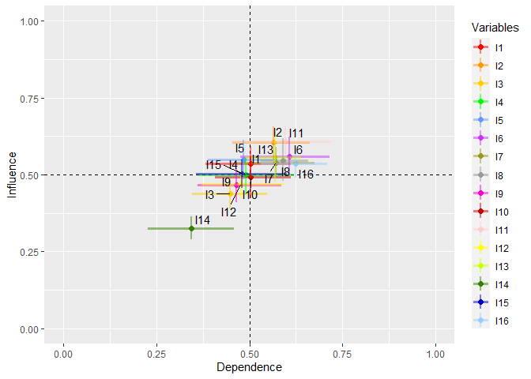

<!-- README.md is generated from README.Rmd. Please edit that file -->

# foRgotten

<!-- badges: start -->
<!-- badges: end -->

## Description

The foRgotten library extends the theory of forgotten effects with the
aggregation of multiple key informants for complete graphs and chain
bipartite graphs. Provides analysis tools for direct effects and
forgotten effects.

The package allows for:

-   Calculation of the average incidence by edges for direct effects.
-   Calculation of the average incidence per row and column for direct
    effects.
-   Calculation of the median betweenness centrality per node for direct
    effects.
-   Calculation of the forgotten effects.
-   Use of complete graphs and chain bipartite graphs.

## Authors

**Elliott Jamil Mardones Arias**  
School of Computer Science  
Universidad Católica de Temuco  
Rudecindo Ortega 02351  
Temuco, Chile  
<emardones2016@inf.uct.cl>

**Julio Rojas-Mora** Department of Computer Science  
Universidad Católica de Temuco  
Rudecindo Ortega 02351 Temuco, Chile  
and Centro de Políticas Públicas  
Universidad Católica de Temuco  
Temuco, Chile  
<jrojas@inf.uct.cl>

## Installation

You can install the stable version of foRgotten from CRAN with:

``` r
# install.packages(“foRgotten”)
```

and the development version from GitHub with:

``` r
#install.packages(“devtools”)
#devtools::install_github("ElliottMardones/foRgotten")
```

## Usage

``` r
library(foRgotten)
```

## 

## Functions

The package provides five functions:

``` r
?directEffects
#> starting httpd help server ... done
```

Computes the mean incidence, lower confidence interval, and p-value with
multiple key informants for complete graphs and chain bipartite graphs.
For more details, see help (de.sq).

``` r
?bootMargin
```

Computes the mean incidence for each cause and each effect, confidence
intervals, and p-value with multiple key informants for complete graphs
and chain bipartite graphs. For more details, see help(bootMargin).

``` r
?centrality
```

Performs the computation of median betweenness centrality with multiple
key informants for complete graphs and chain bipartite graphs. For more
details, see help(centrality).

``` r
?fe.sq
```

It performs the calculation of the forgotten effects proposed by
Kaufmann and Gil-Aluja (1988) with multiple key informants for complete
graphs, with the frequency of appearance of the forgotten effect, mean
incidence, confidence intervals, and standard error. For more details,
see help(fe.sq).

``` r
?fe.rect
```

It performs the calculation of the forgotten effects proposed by
Kaufmann and Gil-Aluja (1988) with multiple key informants for chain
bipartite graphs, with the frequency of appearance of the forgotten
effect, mean incidence, confidence intervals, and standard error. For
more details, see help(fe.rect)

## DataSet

The library provides 3 three-dimensional incidence matrices which are
called `AA`, `AB` and `BB`. The data are those used in the study
“Application of the Forgotten Effects Theory For Assessing the Public
Policy on Air Pollution Of the Commune of Valdivia, Chile” developed by
Manna, E. M et al (2018).

The data consists of 16 incentives, 4 behaviors and 10 key informants,
where each of the key informants presented the data with a minimum and
maximum value for each incident. The description of the data can be seen
in Tables 1 and 2 of Manna, E. M et al (2018).

The book store presents the data with the average between the minimum
and maximum value for each incidence, A being the equivalent to
incentives and B to behaviors. For more details of the data you can
consult:

``` r
help(AA)
help(AB)
help(BB)
```

## Examples

### **directEffects()**

The `directEffects()` function calculates the mean incidence, left
one-sided confidence interval, and p-value with multiple key informants
for complete graphs and chain bipartite graphs.

The function contemplates two modalities, the first is focused on
complete graphs and the second for chain bipartite graphs.

#### For complete graphs

To calculate the significant direct effects of the incidence matrix
`AA`, which is described in DataSet, we use the parameter `CC`, which
allows us to enter a three-dimensional matrix, where each submatrix
along the z-axis is a square incidence matrix and reflective, or a list
of data.frame containing square and reflective incidence matrices. Each
matrix represents a complete graph. The `CE` and `EE` parameters are
used to perform the calculation with chain bipartite graphs, therefore
it is necessary that these parameters are not used.

To define the degree of truth in which the incidence is considered
significant, the parameter `thr` is used, which is defined between
`[0,1]`. By default `thr = 0.5`.

The `directEffects()` function makes use of the `“boot.one.bca”`
function of the `wBoot` package to implement the bootstrap method with
BCa adjusted boot and with a left one-sided hypothesis test based on the
Z-test. The `conf.level` parameter defines the confidence level and
`reps` the number of bootstrap replicas. By default `conf.level = 0.95`
and `reps = 10000`.

For example, let `thr = 0.5` and `reps = 1000`, we get:

``` r
result <- directEffects(CC = AA, thr = 0.5, reps = 1000)
```

The function returns a list object with the `$DirectEffects` data subset
that contains the following values:

-   From: Origin of the incident
-   To: Destination of the incident
-   Mean: Average incidence
-   UCI: Upper Confidence Interval
-   p.value: the calculated p-value

The results obtained correspond to 240 first-order incidents. Equivalent
to the number of edges minus the incidence on itself of each edge. The
first 6 values are:

``` r
head(result$DirectEffects)
#>   From To  Mean   UCI p.value
#> 1   I1 I2 0.525 0.650   0.616
#> 2   I1 I3 0.450 0.595   0.276
#> 3   I1 I4 0.525 0.665   0.581
#> 4   I1 I5 0.465 0.630   0.350
#> 5   I1 I6 0.645 0.780   0.869
#> 6   I1 I7 0.815 0.870   1.000
```

If any of the occurrences have `"NA"` and `"NaN"` values in the UCI and
p.value fields, it indicates that the values for that occurrence have
repeated values. This prevents bootstrapping.

The `delete` parameter allows assigning zeros to edges whose incidences
are significantly less than `thr` to the p-value set in the `conf.level`
parameter. Also, this allows you to remove non-significant results from
the `$DirectEffects` subset.

For example, let `thr = 0.5` and `conf.level = 0.95`, mean incidences
less than `0.5` or incidents with p.value less than `1 - conf.level`
will be eliminated.

``` r
result <- directEffects(CC = AA, thr = 0.5, reps = 1000, delete = TRUE)
#> deleting data...
```

The function reports by console when significant edges have been
removed. The number of significant direct effects decreased from 240 to
205 for `delete = TRUE`.

**Note:** However, this does not guarantee that a non-significant
variable in 1st order does not generate 2nd order effects, since they
are extracted from the empirical distribution of the key informants.

For `delete = TRUE`, the function returns `$Data`, the three-dimensional
matrix entered in the `CC` parameter but assigning 0 to the
non-significant edges.

For chain bipartite graphs To calculate the significant direct effects
of the incidence matrices `AA`, `AB` and `BB`, which are described in
DataSet, we make use of the already described parameter `CC`. The `EE`
parameter is equivalent to the `CC` parameter. The `CE` parameter allows
you to enter a three-dimensional matrix, where each sub-matrix along the
z-axis is a rectangular incidence matrix or a list of data.frame
containing rectangular incidence matrices. Each matrix represents a
bipartite graph.

For example, let `thr = 0.5` and `reps = 1000`, you get:

``` r
result <- directEffects(CC = AA, CE = AB, EE = BB, reps = 1000)
```

The results obtained correspond to 312 first-order incidents. Using the
`delete = TRUE` parameter, the number of first-order significant
occurrences was reduced to 271.

For `delete = TRUE`, the function returns `$CC`, `$CE`, and `$EE`, which
are the three-dimensional matrices entered in the parameters `CC`, `CE`,
and `EE`, but assigning 0 to the non-significant edges.

#### For chain bipartite graphs

To calculate the significant direct effects of the incidence matrices
`AA`, `AB`and `BB`, which are described in DataSet, we make use of the
already described parameter `CC`. The `EE`parameter is equivalent to the
`CC`parameter. The `CE`parameter allows you to enter a three-dimensional
matrix, where each sub-matrix along the z-axis is a rectangular
incidence matrix, or a list of data.frame containing rectangular
incidence matrices. Each matrix represents a bipartite graph.

For example, let `thr = 0.5` and `reps = 1000`, you get:

``` r
result <- directEffects(CC = AA, CE = AB, EE = BB, thr = 0.5, reps = 1000)
```

The results obtained correspond to 312 first-order incidents. Using the
`delete = TRUE` parameter, the number of first order significant
occurrences was reduced to 271.

For `delete = TRUE`, the function returns `$CC`, `$CE` and `$EE`, which
are the three-dimensional matrices entered in the parameters `CC`,
`CE`and `EE`, but assigning 0 to the non-significant edges.

### bootMargin()

The `bootMargin()` function calculates the mean incidence of each cause
and each effect, confidence intervals, and p-value with multiple experts
for complete graphs and chain bipartite graphs.

The function contemplates two modalities, the first is focused on
complete graphs and the second for chain bipartite graphs.

#### **For complete graphs**

To calculate the average incidence of each cause and each effect of the
`AA` incidence matrix, which is described in DataSet, we use the `CC`
parameter, which allows us to enter a three-dimensional matrix, where
each sub-matrix along the z-axis is a reflexive square incidence matrix
or a list of `data.frame` containing square and reflexive incidence
matrices. Each matrix represents a complete graph. The `CE` and `EE`
parameters are used to perform the calculation with chain bipartite
graphs, therefore it is necessary that these parameters are not used.

To define the degree of truth in which the incidence is considered
significant, the parameter `thr` is used, which is defined between
`[0,1]`. By default `thr = 0.5`.

The `bootMargin()` function makes use of the `“boot.one.bca”` function
from the `wBoot` package to implement the bootstrap resampling method
with BCa adjusted boot and with a two-sided hypothesis test based on the
Z-test. The `conf.level` parameter defines the confidence level and
`reps` the number of bootstrap replicas. By default `conf.level = 0.95`
and `reps = 10000`.

For example, let `thr = 0.6` and `reps = 1000` we get:

``` r
result <- bootMargin(CC = AA, thr = 0.6, reps = 1000)
```

The function returns a list object with the data subsets `$byRow` and
`$byCol`, each of these subsets of data contains the following values:

-   Var: Variable name
-   Mean: Calculated mean.
-   LCI: Lower Confidence Interval
-   ICU: Upper Confidence Interval
-   p.value: the calculated p-value.

The `bootMargin()` function allows you to analyze by node or by
variable. The results obtained are:

For `$byRow`

``` r
result$byRow
#>    Var      Mean    LCI    UCI  p.value
#> 1   I1 0.5258727 0.4720 0.5821 1.85e-02
#> 2   I2 0.5985957 0.5523 0.6591 9.28e-01
#> 3   I3 0.4270930 0.3571 0.4728 9.67e-05
#> 4   I4 0.4921870 0.3975 0.5372 1.21e-05
#> 5   I5 0.5350327 0.4757 0.5993 5.10e-02
#> 6   I6 0.5526170 0.4777 0.6191 1.50e-01
#> 7   I7 0.5317283 0.4750 0.5816 4.40e-03
#> 8   I8 0.5449203 0.4646 0.6033 5.94e-02
#> 9   I9 0.4655540 0.3938 0.5142 2.06e-04
#> 10 I10 0.4747620 0.3907 0.5419 3.57e-04
#> 11 I11 0.5982173 0.5513 0.6439 8.79e-01
#> 12 I12 0.4545917 0.3893 0.5013 1.04e-04
#> 13 I13 0.5577460 0.4630 0.6276 2.45e-01
#> 14 I14 0.2495607 0.2060 0.2920 1.11e-03
#> 15 I15 0.4398020 0.3946 0.4975 2.96e-03
#> 16 I16 0.5138287 0.4571 0.5653 1.96e-03
```

For `$byCol`

``` r
result$byCol
#>    Var      Mean    LCI    UCI  p.value
#> 1   I1 0.4821017 0.3608 0.5760 0.012100
#> 2   I2 0.5568250 0.4241 0.6556 0.409000
#> 3   I3 0.4174793 0.3190 0.5177 0.000874
#> 4   I4 0.4714180 0.3509 0.5784 0.021800
#> 5   I5 0.4625633 0.3646 0.5440 0.002220
#> 6   I6 0.5897433 0.4116 0.6682 0.760000
#> 7   I7 0.5567090 0.4398 0.6592 0.457000
#> 8   I8 0.5752367 0.5142 0.6425 0.416000
#> 9   I9 0.4485240 0.3559 0.5600 0.004160
#> 10 I10 0.4675077 0.3598 0.5656 0.007420
#> 11 I11 0.5823917 0.4268 0.6984 0.662000
#> 12 I12 0.4537970 0.3397 0.5633 0.010100
#> 13 I13 0.5633353 0.4764 0.6356 0.314000
#> 14 I14 0.2748313 0.1914 0.3336 0.000128
#> 15 I15 0.4739790 0.3457 0.5950 0.041100
#> 16 I16 0.5916767 0.5176 0.6854 0.888000
```

The function allows eliminating causes and effects whose average
incidence is not significant at the set `thr` parameter. For example,
for `delete = TRUE`, the number of significant variables decreased.

``` r
result <- bootMargin(CC = AA, thr = 0.6, reps = 1000, delete = TRUE)
```

For `$byRow`

``` r
result$byRow
#>    Var      Mean    LCI    UCI p.value
#> 2   I2 0.5997410 0.5496 0.6536 0.99900
#> 6   I6 0.5551407 0.4786 0.6158 0.16200
#> 7   I7 0.5313887 0.4840 0.5910 0.02350
#> 8   I8 0.5444307 0.4658 0.6063 0.10300
#> 11 I11 0.5970853 0.5527 0.6463 0.96000
#> 13 I13 0.5546253 0.4616 0.6353 0.26400
#> 15 I15 0.4425877 0.3948 0.4997 0.00202
#> 16 I16 0.5119393 0.4619 0.5671 0.00289
```

For `$byCol`

``` r
result$byCol
#>    Var      Mean    LCI    UCI p.value
#> 2   I2 0.5545437 0.4283 0.6534  0.3920
#> 6   I6 0.5886483 0.4137 0.6634  0.6920
#> 7   I7 0.5608150 0.4351 0.6493  0.3900
#> 8   I8 0.5736350 0.5138 0.6500  0.5330
#> 11 I11 0.5756640 0.4341 0.7067  0.7650
#> 13 I13 0.5621100 0.4735 0.6330  0.2940
#> 15 I15 0.4744073 0.3447 0.6019  0.0588
#> 16 I16 0.5914770 0.5153 0.6877  0.8980
```

For `delete = TRUE`, the function returns`$Data`, the matrix entered in
the `CC`parameter, but with the non-significant rows and columns
removed.

For `plot = TRUE`, the function returns `$plot`, which contains the
graph generated from the subsets `$byRow` and `$byCol`. On the x-axis
are the “Dependence” associated with `$byCol` and on the y-axis the
“Influence” is associated with `$byRow`.

``` r
result <- bootMargin(CC = AA, thr = 0.6, reps = 1000, delete = TRUE, plot = TRUE)
result$plot
```



#### **For chain bipartite graphs**

To calculate the average incidence of each cause and each effect of the
incidence matrices `AA`, `AB`and `BB`, which are described in DataSet,
we make use of the already described parameter `CC`. The `EE`parameter
is equivalent to the `CC`parameter. The `CE`parameter allows you to
enter a three-dimensional matrix, where each sub-matrix along the z-axis
is a rectangular incidence matrix or a list of data.frame containing
rectangular incidence matrices. Each matrix represents a bipartite
graph.

For example, let `thr = 0.5` and `reps = 1000`, you get:

``` r
result <- bootMargin(CC = AA, CE = AB, EE = BB, thr = 0.6, reps = 1000)
```

The results obtained correspond to all the nodes or variables found in
the entered matrices.

The results for `$byRow` and `$byCol` are:

For `$byRow`

``` r
result$byRow
#>    Var      Mean    LCI    UCI  p.value
#> 1   I1 0.5146947 0.4726 0.5655 0.002320
#> 2   I2 0.6296545 0.5796 0.6755 0.295000
#> 3   I3 0.4552811 0.4004 0.5205 0.001800
#> 4   I4 0.5106147 0.4414 0.5756 0.003370
#> 5   I5 0.5474253 0.4855 0.6042 0.071200
#> 6   I6 0.5820687 0.5117 0.6509 0.588000
#> 7   I7 0.5728803 0.5214 0.6270 0.387000
#> 8   I8 0.5732129 0.5035 0.6319 0.337000
#> 9   I9 0.4792955 0.4208 0.5459 0.001220
#> 10 I10 0.5177837 0.4424 0.5881 0.031000
#> 11 I11 0.6522637 0.5928 0.7242 0.086100
#> 12 I12 0.4770845 0.4174 0.5356 0.001150
#> 13 I13 0.6229845 0.5378 0.7168 0.564000
#> 14 I14 0.2434563 0.2023 0.2859 0.001200
#> 15 I15 0.4601863 0.4098 0.5032 0.000786
#> 16 I16 0.5275261 0.4728 0.5692 0.000351
#> 17  B1 0.6787033 0.6000 0.7200 0.232000
#> 18  B2 0.6779300 0.5700 0.7550 0.232000
#> 19  B3 0.6759383 0.5500 0.7717 0.516000
#> 20  B4 0.8084133 0.8000 0.8150 0.000901
```

For `$byCol`

``` r
result$byCol
#>    Var      Mean    LCI    UCI  p.value
#> 1   I1 0.4835500 0.3629 0.5627 0.002230
#> 2   I2 0.5542360 0.4332 0.6646 0.473000
#> 3   I3 0.4198490 0.3081 0.5132 0.001730
#> 4   I4 0.4728523 0.3471 0.5816 0.015200
#> 5   I5 0.4627920 0.3665 0.5517 0.001390
#> 6   I6 0.5877167 0.4039 0.6645 0.776000
#> 7   I7 0.5602563 0.4465 0.6502 0.425000
#> 8   I8 0.5738367 0.5096 0.6466 0.504000
#> 9   I9 0.4473783 0.3539 0.5569 0.001890
#> 10 I10 0.4669543 0.3648 0.5699 0.008740
#> 11 I11 0.5775727 0.4402 0.7003 0.735000
#> 12 I12 0.4541050 0.3409 0.5751 0.012100
#> 13 I13 0.5620793 0.4834 0.6417 0.335000
#> 14 I14 0.2722737 0.1945 0.3377 0.000270
#> 15 I15 0.4748077 0.3523 0.5899 0.038900
#> 16 I16 0.5910693 0.5199 0.6832 0.924000
#> 17  B1 0.5428911 0.4415 0.6575 0.279000
#> 18  B2 0.6749558 0.6111 0.7689 0.013600
#> 19  B3 0.6885011 0.6321 0.7736 0.000899
#> 20  B4 0.6289803 0.5335 0.7293 0.572000
```

For `delete = TRUE`, the function returns `$CC`, `$CE`, and `$EE`, which
are the three-dimensional arrays entered in the `CC`, `CE`, and `EE`
parameters, but with the rows and columns removed.

For `plot = TRUE`, the function returns `$plot`, which contains the
graph generated from the subsets `$byRow` and `$byCol`. On the x-axis
are the “Dependence” associated with `$byCol` and on the y-axis the
“Influence” is associated with `$byRow`.

### centralitry()

The `centrality()` function calculates the median betweenness
centrality, confidence intervals, and the selected method for
calculating the centrality distribution for complete graphs and chain
bipartite graphs.

The function contemplates two modalities, the first is focused on
complete graphs and the second for chain bipartite graphs.

#### For complete graphs

To calculate the median betweenness centrality of the incidence matrix
`AA`, which is described in DataSet, we use the parameter `CC`, which
allows us to enter a three-dimensional matrix, where each submatrix
along the z-axis is a square incidence matrix and reflective, or a list
of data.frame containing square and reflective incidence matrices. Each
matrix represents a complete graph. The `CE`and `EE`parameters are used
to perform the calculation with chain bipartite graphs, therefore it is
necessary that these parameters are not used.

The `centrality()` function makes use of the `“boot”` function from the
boot package (Canty A, Ripley BD, 2021) to implement the bootstrap
method with BCa tight boot. The number of bootstrap replicas is defined
in the `reps`parameter. By default `reps = 10000`.

The model parameter allows bootstrapping with some of the following
statistics: mediate.

-   `median`.
-   `conpl`: Calculate the median of a power distribution according to
    Newman M.E (2005).
-   `conlnorm`: Calculates the median of a power distribution according
    to Gillespie CS (2015).

The objective of the model parameter is to determine to which
heavy-tailed distribution the variables or nodes of the entered
parameter correspond.

For example, let `model = "median"` and `reps = 300`, we will obtain:

``` r
result <- centrality(CC = AA, model = "median", reps = 300)
#> Warning in resultBoot_median(output_resultIgraph, parallel, reps, ncpus, :
#> Variable I3 has median = 0
#> Warning in resultBoot_median(output_resultIgraph, parallel, reps, ncpus, :
#> Variable I9 has median = 0
#> Warning in resultBoot_median(output_resultIgraph, parallel, reps, ncpus, :
#> Variable I12 has median = 0
#> Warning in resultBoot_median(output_resultIgraph, parallel, reps, ncpus, :
#> Variable I14 has median = 0
```

The returned object of type data.frame contains the following
components:

-   Var: Name of the variable.
-   Median: Median calculated.
-   LCI: Lower Confidence Interval.
-   ICU: Upper Confidence Interval.
-   Method: Statistical method used associated with the model parameter.

If the median calculated for any of the betweenness centrality has a
median equal to 0, the LCI and UCI fields will have a value equal to 0.
This is reported with a warning per console.

The results are:

``` r
result
#>    Var     Median       LCI       UCI Method
#> 1   I1 13.1666667 0.0000000 21.358333 median
#> 2   I2 12.9875000 2.2500000 25.166667 median
#> 3   I3  0.0000000 0.0000000  0.000000 median
#> 4   I4  0.8333333 0.0000000  1.408654 median
#> 5   I5  6.2083333 0.3250000 10.000000 median
#> 6   I6 20.2791667 4.5607143 42.583333 median
#> 7   I7 11.0833333 1.8823211 42.833333 median
#> 8   I8  4.7083333 0.1369912 10.333333 median
#> 9   I9  0.0000000 0.0000000  0.000000 median
#> 10 I10  1.5000000 0.0000000 10.641103 median
#> 11 I11 15.8333333 2.6250000 30.416667 median
#> 12 I12  0.0000000 0.0000000  0.000000 median
#> 13 I13  4.7916667 1.0000000 10.983218 median
#> 14 I14  0.0000000 0.0000000  0.000000 median
#> 15 I15  2.5000000 0.0000000  8.583333 median
#> 16 I16 13.1666667 4.8214110 28.458333 median
```

Now if we use `"conpl"` in the model parameter and 300 bootstrap
replicas, we get:

``` r
result <- centrality(CC = AA, model = "conpl", reps = 300)
#> Warning in conpl_function(resultCent = output_resultIgraph, parallel =
#> parallel, : Variable I3 has median = 0
#> Warning in conpl_function(resultCent = output_resultIgraph, parallel =
#> parallel, : Variable I9 has median = 0
#> Warning in conpl_function(resultCent = output_resultIgraph, parallel =
#> parallel, : Variable I12 has median = 0
#> Warning in conpl_function(resultCent = output_resultIgraph, parallel =
#> parallel, : Variable I14 has median = 0
result
#>    Var     Median       LCI       UCI Method
#> 1   I1 13.1666667 0.0000000 23.711846 median
#> 2   I2 12.9875000 1.5000000 24.125000 median
#> 3   I3  0.0000000 0.0000000  0.000000 median
#> 4   I4  0.8333333 0.0000000  2.079167 median
#> 5   I5  6.2083333 0.6666667 10.000000 median
#> 6   I6 20.2791667 2.5617546 42.583333 median
#> 7   I7 11.0833333 2.0000000 40.748114 median
#> 8   I8  4.7083333 0.1000000 10.538004 median
#> 9   I9  0.0000000 0.0000000  0.000000 median
#> 10 I10  1.5000000 0.0000000  8.125000 median
#> 11 I11 15.8333333 0.7500000 27.041667 median
#> 12 I12  0.0000000 0.0000000  0.000000 median
#> 13 I13  4.7916667 0.0000000  9.916667 median
#> 14 I14  0.0000000 0.0000000  0.000000 median
#> 15 I15  2.5000000 0.0000000 10.266463 median
#> 16 I16 13.1666667 3.2718870 28.458333 median
```

**Note:** If the calculation cannot be performed with `model = "conpl"`
in some node, the function will perform the calculation with `"median"`.
This change is indicated in the Method field.

Now if we use `"conlnorm"` in the model parameter and 300 bootstrap
replicas, we get:

``` r
result <- centrality(CC = AA, model = "conlnorm", reps = 300)
#> Warning in conlnorm_function(resultCent = output_resultIgraph, parallel =
#> parallel, : Variable I3 has median = 0
#> Warning in conlnorm_function(resultCent = output_resultIgraph, parallel =
#> parallel, : Variable I9 has median = 0
#> Warning in conlnorm_function(resultCent = output_resultIgraph, parallel =
#> parallel, : Variable I12 has median = 0
#> Warning in conlnorm_function(resultCent = output_resultIgraph, parallel =
#> parallel, : Variable I14 has median = 0
result
#>    Var     Median       LCI       UCI Method
#> 1   I1 13.1666667 0.0000000 22.716667 median
#> 2   I2 12.9875000 2.4594065 24.125000 median
#> 3   I3  0.0000000 0.0000000  0.000000 median
#> 4   I4  0.8333333 0.0000000  2.079167 median
#> 5   I5  6.2083333 0.5943483 10.000000 median
#> 6   I6 20.2791667 2.1074907 42.583333 median
#> 7   I7 11.0833333 1.6877757 41.000000 median
#> 8   I8  4.7083333 0.1000000 10.833333 median
#> 9   I9  0.0000000 0.0000000  0.000000 median
#> 10 I10  1.5000000 0.0000000  8.125000 median
#> 11 I11 15.8333333 1.8444338 30.416667 median
#> 12 I12  0.0000000 0.0000000  0.000000 median
#> 13 I13  4.7916667 0.5000000  9.916667 median
#> 14 I14  0.0000000 0.0000000  0.000000 median
#> 15 I15  2.5000000 0.0000000  8.583333 median
#> 16 I16 13.1666667 2.5833333 23.479167 median
```

**Note:** If the calculation cannot be performed with
`model = "conlnorm"` in some node, the function will perform the
calculation with “median”. This change is indicated in the Method field

**IMPORTANT:** The best statistic to use in the model parameter will
depend on the data and the number of bootstrap replicas that you deem
appropriate.

The `centrality()` function implements the parallel function from the
boot package. The `parallel`parameter allows you to set the type of
parallel operation that is required. The options are `"multicore"`,
`"snow"` and `"no"`. By default `parallel = "no"`. The number of
processors to be used in the paralell implementation is defined in the
`ncpus`parameter. By default `ncpus = 1`.

The `parallel`and `ncpus`options are not available on Windows operating
systems.

**For chain bipartite graphs**

To calculate the median betweenness centrality of the incidence matrices
`AA`, `AB`and `BB`, which are described in DataSet, we make use of the
already described parameter `CC`. The `EE`parameter is equivalent to the
`CC`parameter. The `CE`parameter allows you to enter a three-dimensional
matrix, where each sub-matrix along the z-axis is a rectangular
incidence matrix, or a list of data.frame containing rectangular
incidence matrices. Each matrix represents a bipartite graph.

For example, let `model = "conpl"` and `reps = 300`, you get:

``` r
result <- centrality(CC = AA, CE = AB, EE = BB, model = "conpl", reps = 300)
#> Warning in norm.inter(t, adj.alpha): extreme order statistics used as endpoints
#> Warning in conpl_function(resultCent = output_resultIgraph, parallel =
#> parallel, : Variable I3 has median = 0
#> Warning in norm.inter(t, adj.alpha): extreme order statistics used as endpoints
#> Warning in conpl_function(resultCent = output_resultIgraph, parallel =
#> parallel, : Variable I14 has median = 0
#> Warning in conpl_function(resultCent = output_resultIgraph, parallel =
#> parallel, : Variable B1 has median = 0
result
#>    Var     Median        LCI       UCI Method
#> 1   I1 14.0416667  0.0000000 30.094380 median
#> 2   I2 14.6913273 12.4526247 16.856514  conpl
#> 3   I3  0.0000000  0.0000000  0.000000 median
#> 4   I4  0.9166667  0.1666667 14.479167 median
#> 5   I5  6.2083333  0.3250000 11.666667 median
#> 6   I6 24.6720238  6.6666667 60.916667 median
#> 7   I7  9.2552918  1.1114866 24.752043  conpl
#> 8   I8  8.2761905  2.1416667 15.000000 median
#> 9   I9  0.3750000  0.0000000  3.650000 median
#> 10 I10  1.5714286  0.4036013 16.797619 median
#> 11 I11 21.0241962 12.6584512 21.558948  conpl
#> 12 I12  3.3333333  0.0000000 11.848968 median
#> 13 I13  5.0166667  1.5212813 14.416667 median
#> 14 I14  0.0000000  0.0000000  0.000000 median
#> 15 I15  2.5000000  0.0000000 16.720150 median
#> 16 I16 18.7916667  4.8907676 37.411650 median
#> 17  B1  0.0000000  0.0000000  0.000000 median
#> 18  B2  2.7833333  0.0000000  5.500000 median
#> 19  B3  2.0000000  0.2500000  3.071429 median
#> 20  B4  1.8666667  0.0000000  7.200000 median
```

The `centrality()` function implements the parallel function from the
`boot`package. The `parallel`parameter allows you to set the type of
parallel operation that is required. The options are `"multicore"`,
`"snow"` and `"no"`. By default `parallel = "no"`. The number of
processors to be used in the `paralell`implementation is defined in the
`ncpus`parameter. By default `ncpus = 1`.

The `parallel`and `ncpus`options are not available on Windows operating
systems.

### fe.sq()

The function `fe.sq()`, calculates the forgotten effects (Kaufmann & Gil
Aluja, 1988) with multiple experts for complete graphs, with calculation
of the frequency of appearance of the forgotten effects, mean incidence,
confidence intervals and standard error

For example, to perform the calculation using the incidence matrix `AA`,
described in DATASET, we use the parameter `CC`, which allows us to
enter a three-dimensional matrix, where each sub-matrix along the z axis
is a square and reflective incidence matrix , or a list of data.frame
containing square and reflective incidence matrices. Each matrix
represents a complete graph.

To define the degree of truth in which the incidence is considered
significant, the parameter `thr`is used, which is defined between
`[0,1]`. By default `thr = 0.5`.

To define the maximum order of the forgotten effects, use the
`maxOrder`parameter. By default `maxOrder = 2`.

The `fe.sq()` function makes use of the `“boot”` function from the boot
package (Canty A, Ripley BD, 2021) to implement bootstrap with BCa tight
boot. The number of bootstrap replicas is defined in the `reps`
parameter. By default `reps = 10000`.

For example, let `thr = 0.5`, `maxOrder = 3` and `reps = 1000`, you get:

``` r
result <- fe.sq(CC = AA, thr = 0.5, maxOrder = 3, reps = 1000)
```

The returned object of type list contains two subsets of data. The
`$boot` data subset is a list of data.frame where each data.frame
represents the order of the calculated forgotten effect, the components
are:

-   From: Indicates the origin of the forgotten effects relationships.
-   Through_x: Dynamic field that represents the intermediate
    relationships of the forgotten effects. For example, for order n
    there will be “though_1” up to “though\_ \<n-1>”.
-   To: Indicates the end of the forgotten effects relationships.
-   Count: Number of times the forgotten effect was repeated.
-   Mean: Mean effect of the forgotten effect
-   LCI: Lower Confidence Intervals.
-   UCI: Upper Confidence Intervals.
-   SE: Standard error.

The `$byExperts` data subset is a list of `data.frame` where each
`data.frame` represents the order of the forgotten effect calculated
with its associated incidence value for each expert, the components are:

-   From: Indicates the origin of the forgotten effects relationships.
-   Through_x: Dynamic field that represents the intermediate
    relationships of the forgotten effects. For example, for order n
    there will be “though_1” up to “though\_ \<n-1>”.
-   To: Indicates the end of the forgotten effects relationships.
-   Count: Number of times the forgotten effect was repeated.
-   Expert_x: Dynamic field that represents each of the entered experts.
-   

If we look at the data in the `$boot$Order_2` data subset, we find 706
2nd order effects and 611 of these effects are unique. The first 6 are:

``` r
head(result$boot$Order_2)
#>   From Through_1  To Count      Mean    LCI       UCI         SE
#> 1   I8       I11 I10     4 0.6125000 0.5625 0.6625000 0.02744222
#> 2   I5       I11 I10     3 0.6166667 0.5500 0.6666667 0.03630145
#> 3   I6       I11 I14     3 0.6833333 0.6000 0.7666667 0.06819440
#> 4  I13       I11 I14     3 0.5833333 0.5500 0.6000000 0.01378768
#> 5  I13        I6  I1     3 0.6333333 0.6000 0.6666667 0.02654994
#> 6  I13       I16  I1     3 0.6333333 0.6000 0.6666667 0.02701917
```

The relations I8 -> I11 -> I10 appeared 4 times. To know exactly in
which expert these relationships were found, there is the `$byExperts`
data subset. If we look at the first row of `$byExperts$order_2` we can
identify the experts who provided this information.

``` r
head(result$byExperts$Order_2)
#>   From Through_1  To Count Expert_1 Expert_2 Expert_3 Expert_4 Expert_5
#> 1   I8       I11 I10     4     0.55      0.6     0.00      0.6      0.0
#> 2   I5       I11 I10     3     0.55      0.7     0.00      0.0      0.0
#> 3   I6       I11 I14     3     0.00      0.6     0.85      0.6      0.0
#> 4  I13       I11 I14     3     0.00      0.6     0.00      0.6      0.0
#> 5  I13        I6  I1     3     0.00      0.0     0.60      0.6      0.0
#> 6  I13       I16  I1     3     0.00      0.0     0.00      0.6      0.7
#>   Expert_6 Expert_7 Expert_8 Expert_9 Expert_10
#> 1      0.7     0.00      0.0        0       0.0
#> 2      0.0     0.00      0.6        0       0.0
#> 3      0.0     0.00      0.0        0       0.0
#> 4      0.0     0.55      0.0        0       0.0
#> 5      0.0     0.00      0.0        0       0.7
#> 6      0.0     0.00      0.6        0       0.0
```

**IMPORTANT**: If any of the `$boot` values shows `"NA"` in LCI, UCI and
SE, it indicates that the values of the incidents per expert are the
same or the value is unique. That prevents implementing bootstrap.

The `fe.sq()` function implements the parallel function from the boot
package. The parallel parameter allows you to set the type of parallel
operation that is required. The options are `"multicore"`, `"snow"` and
`"no"`. By default `parallel = "no"`. The number of processors to be
used in the `paralell`implementation is defined in the `ncpus`parameter.
By default `ncpus = 1`.

The `parallel` and `ncpus`options are not available on Windows operating
systems.

### fe.rect()

The function `fe.rect()`, calculates the forgotten effects (Kaufmann &
Gil Aluja, 1988) with multiple key informants for chain bipartite
graphs, with calculation of the frequency of appearance of the forgotten
effects, mean incidence, confidence intervals and standard error.

To perform the calculation using the incidence matrices `AA`, `AB`and
`BB`, which are described in DataSet, we make use of the already
described parameter `CC`. The `EE` parameter is equivalent to the `CC`
parameter. The `CE` parameter allows you to enter a three-dimensional
matrix, where each sub-matrix along the z-axis is a rectangular
incidence matrix, or a list of data.frame containing rectangular
incidence matrices. Each matrix represents a bipartite graph.

To define the degree of truth in which the incidence is considered
significant, the parameter `thr` is used, which is defined between
`[0,1]`. By default `thr = 0.5`.

To define the maximum order of the forgotten effects, use the
`maxOrder`parameter. By default `maxOrder = 2`.

The `fe.rect()` function makes use of the `“boot”` function from the
boot package (Canty A, Ripley BD, 2021) to implement bootstrap with BCa
tight boot.. The number of bootstrap replicas is defined in the `reps`
parameter. By default `reps = 10000`.

For example, let `thr = 0.5`, `maxOrder = 3` and `reps = 1000`, you get:

``` r
result <- fe.rect(CC = AA,CE = AB, EE = BB, thr = 0.5, maxOrder = 3, reps = 1000)
#> Warning in wrapper.indirectEffects_R(CC = CC, CE = CE, EE = EE, thr = thr, :
#> Expert number 7 has no 2nd maxOrder or higher effects.
```

The returned object of type list contains two subsets of data. The
`$boot` data subset is a list of data.frame where each data.frame
represents the order of the calculated forgotten effect, the components
are:

-   From: Indicates the origin of the forgotten effects relationships.
-   Through_x: Dynamic field that represents the intermediate
    relationships of the forgotten effects. For example, for order n
    there will be “though_1” up to “though\_ \<n-1>”.
-   To: Indicates the end of the forgotten effects relationships.
-   Count: Number of times the forgotten effect was repeated.
-   Mean: Mean effect of the forgotten effect
-   LCI: Lower Confidence Intervals.
-   UCI: Upper Confidence Intervals.
-   SE: Standard error.

The `$byExperts` data subset is a list of `data.frame` where each
`data.frame` represents the order of the forgotten effect calculated
with its associated incidence value for each expert, the components are:

-   From: Indicates the origin of the forgotten effects relationships.

-   Through_x: Dynamic field that represents the intermediate
    relationships of the forgotten effects. For example, for order n
    there will be “though_1” up to “though\_ \<n-1>”.

-   To: Indicates the end of the forgotten effects relationships.

-   Count: Number of times the forgotten effect was repeated.

-   Expert_x: Dynamic field that represents each of the entered experts.

If we look at the data in the `$boot$Order_2` data subset, we find 182
2nd order effects and 162 of these effects are unique. The first 6 are:

``` r
head(result$boot$Order_2)
#>   From Through_1 To Count      Mean  LCI       UCI         SE
#> 1   I5        B4 B1     3 0.6333333 0.60 0.6666667 0.02776228
#> 2   I6        I7 B1     2 0.8000000 0.75 0.8000000 0.03423229
#> 3   I8        I7 B1     2 0.6250000 0.60 0.6250000 0.01762555
#> 4  I12        I2 B1     2 0.7000000 0.65 0.7000000 0.03533165
#> 5  I10       I11 B2     2 0.5750000 0.55 0.6000000 0.01808858
#> 6  I14       I15 B2     2 0.7250000 0.70 0.7500000 0.01789183
```

The relations I5 -> B4 -> B1 appeared 3 times. To know exactly in which
expert these relationships were found, there is the `$byExperts` data
subset. If we look at the first row of `$byExperts$order_2` we can
identify the experts who provided this information.

``` r
head(result$byExperts$Order_2)
#>   From Through_1 To Count Expert_1 Expert_2 Expert_3 Expert_4 Expert_5 Expert_6
#> 1   I5        B4 B1     3     0.60      0.7        0     0.60     0.00        0
#> 2   I6        I7 B1     2     0.75      0.0        0     0.85     0.00        0
#> 3   I8        I7 B1     2     0.65      0.6        0     0.00     0.00        0
#> 4  I12        I2 B1     2     0.65      0.0        0     0.75     0.00        0
#> 5  I10       I11 B2     2     0.60      0.0        0     0.00     0.55        0
#> 6  I14       I15 B2     2     0.75      0.0        0     0.00     0.70        0
#>   Expert_7 Expert_8 Expert_9 Expert_10
#> 1        0        0        0         0
#> 2        0        0        0         0
#> 3        0        0        0         0
#> 4        0        0        0         0
#> 5        0        0        0         0
#> 6        0        0        0         0
```

**MPORTANT:** If any of the `$boot` values shows `"NA"` in LCI, UCI and
SE, it indicates that the values of the incidents per expert are the
same or the value is unique. That prevents implementing bootstrap.

The `fe.sq()` function implements the parallel function from the boot
package. The `parallel`parameter allows you to set the type of parallel
operation that is required. The options are `"multicore"`, `"snow"` and
`"no"`. By default `parallel = "no"`. The number of processors to be
used in the `paralell` implementation is defined in the `ncpus`
parameter. By default `ncpus = 1`.

The `parallel` and `ncpus` options are not available on Windows
operating systems.

## References

1.  Kaufmann, A., & Gil Aluja, J. (1988). Modelos para la Investigación
    de efectos olvidados, Milladoiro. Santiago de Compostela, España.

2.  Manna, E. M., Rojas-Mora, J., & Mondaca-Marino, C. (2018).
    Application of the Forgotten Effects Theory for Assessing the Public
    Policy on Air Pollution of the Commune of Valdivia, Chile. In From
    Science to Society (pp. 61-72). Springer, Cham.

3.  Freeman, L.C. (1979). Centrality in Social Networks I: Conceptual
    Clarification. Social Networks, 1, 215-239.

4.  Ulrik Brandes, A Faster Algorithm for Betweenness Centrality.
    Journal of Mathematical Sociology 25(2):163-177, 2001.

5.  Canty A, Ripley BD (2021). boot: Bootstrap R (S-Plus) Functions. R
    package version 1.3-28.

6.  Davison AC, Hinkley DV (1997). Bootstrap Methods and Their
    Applications. Cambridge University Press, Cambridge. ISBN
    0-521-57391-2, <http://statwww.epfl.ch/davison/BMA/>.

7.  Newman, M. E. (2005). Power laws, Pareto distributions and Zipf’s
    law. Contemporary physics, 46(5), 323-351.

8.  Gillespie, C. S. (2014). Fitting heavy tailed distributions: the
    poweRlaw package. arXiv preprint arXiv:1407.3492.

9.  <https://cran.r-project.org/web/packages/wBoot/index.html>
