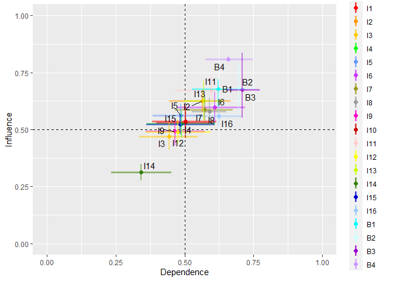
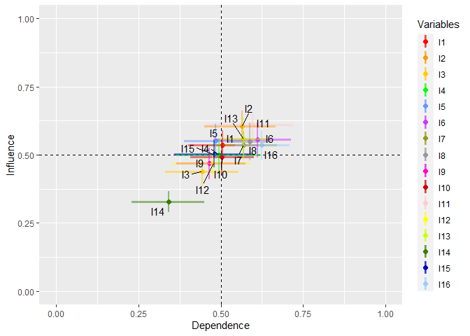

<!-- README.md is generated from README.Rmd. Please edit that file -->

# foRgotten

<!-- badges: start -->
<!-- badges: end -->

## Description

The foRgotten library extends the theory of forgotten effects with the
aggregation of multiple key informants for complete graphs and chain
bipartite graphs. Provides analysis tools for direct effects and
forgotten effects.

The package allows for:

-   Calculation of the average incidence by edges for direct effects.
-   Calculation of the average incidence per row and column for direct
    effects.
-   Calculation of the median betweenness centrality per node for direct
    effects.
-   Calculation of the forgotten effects.
-   Use of complete graphs and chain bipartite graphs.

## Authors

**Elliott Jamil Mardones Arias** School of Computer Science Universidad
Católica de Temuco Rudecindo Ortega 02351 Temuco, Chile
<elliott.mardones@uct.cl>

**Julio Rojas-Mora** Department of Computer Science Universidad Católica
de Temuco Rudecindo Ortega 02351 Temuco, Chile and Centro de Políticas
Públicas Universidad Católica de Temuco Temuco, Chile
<julio.rojas@uct.cl>

## Installation

You can install the stable version of foRgotten from CRAN with:

``` r
# install.packages(“foRgotten”)
```

and the development version from GitHub with:

``` r
#install.packages(“devtools”)
#devtools::install_github("ElliottMardones/foRgotten")
```

## Usage

``` r
library(foRgotten)
```

## 

## Functions

The package provides four functions:

``` r
?directEffects
#> starting httpd help server ... done
```

Computes the mean incidence, left one-sided confidence interval, and
p-value with multiple key informants for complete graphs and chained
bipartite graphs. For more details, see help (de.sq).

``` r
?bootMargin
```

Computes the mean incidence for each cause and each effect, confidence
intervals, and p-value with multiple key informants for complete graphs
and chain bipartite graphs. For more details, see help(bootMargin).

``` r
?centrality
```

Performs the computation of median betweenness centrality with multiple
key informants for complete graphs and chain bipartite graphs. For more
details, see help(centrality).

``` r
?FE
```

Performs the forgotten effects calculation proposed by Kaufman and
Gil-Aluja (1988) with multiple experts. The parameters allow you to
specify the significant degree of truth and the order of incidence that
is required to be calculated for chained bipartite graphs For more
details, see help(FE).

## DataSet

The library provides 3 three-dimensional incidence matrices which are
called `CC`, `CE` and `EE`. The data are those used in the study
“Application of the Forgotten Effects Theory For Assessing the Public
Policy on Air Pollution Of the Commune of Valdivia, Chile” developed by
Manna, E. M et al (2018).

The data consists of 16 incentives, 4 behaviors and 10 key informants,
where each of the key informants presented the data with a minimum and
maximum value for each incident. The description of the data can be seen
in Tables 1 and 2 of Manna, E. M et al (2018).

The book store presents the data with the average between the minimum
and maximum value for each incidence, A being the equivalent to
incentives and B to behaviors. For more details of the data you can
consult:

``` r
help(CC)
help(CE)
help(EE)
```

## Examples

## **directEffects()**

The `directEffects()` function calculates the mean incidence, left-sided
confidence interval, and p-value for complete and chained bipartite
graphs using multiple key informants. This function performs a t-test
with left one-sided contrast via bootstrap BCa.

The function returns a list object with the subset of data
`$DirectEffects` that includes the following information:

-   **From**: Origin of the incidence.
-   **To**: Destination of the incidence.
-   **Mean**: Average incidence.
-   **UCI**: Upper confidence interval.
-   **p.value**: Calculated p-value.

### Parameters

-   **CC**: It allows for entering a three-dimensional incidence array,
    with each submatrix along the z-axis being a square incidence
    matrix. By default, `CC = NULL`.
-   **CE**: It allows for entering a three-dimensional incidence array,
    with each submatrix along the z-axis being a square incidence matrix
    (for complete graphs) or a rectangular matrix (for chained bipartite
    graphs).
-   **EE**: It allows for entering a three-dimensional incidence array,
    with each submatrix along the z-axis being a square incidence
    matrix. By default, `EE = NULL`.
-   **thr**: Defines the degree of truth in which incidence is
    considered significant within the range \[0,1\]. By default,
    `thr = 0.5`.
-   **conf.level**: Defines the confidence level. By default,
    `conf.level = 0.95`.
-   **reps**: Defines the number of bootstrap replicates. By default,
    `reps = 10000`.
-   **delete**: Removes the non-significant results from the
    `$DirectEffects` set and returns the entered three-dimensional
    incidence arrays by assigning zeros to the edges whose incidences
    are significantly lower than `thr` at the p-value set in the
    `conf.level` parameter. By default, `delete = FALSE`.

#### Example: Chained bipartite graphs

For example, to calculate the average incidence for each edge of the
three-dimensional incidence arrays `CC`, `CE`, and `EE`, with the
parameters `thr = 0.5` and `reps = 1000`, we use the `directEffects()`
function:

``` r
result <- directEffects(CC = CC, CE = CE, EE = EE, thr = 0.5, reps = 1000)
```

The result obtained is a data.frame of 312 rows. The first ten items are
displayed.

``` r
result$DirectEffects[1:10,]
#>    From  To  Mean     UCI p.value
#> 1    I1  I2 0.525 0.64500   0.617
#> 2    I1  I3 0.450 0.59000   0.284
#> 3    I1  I4 0.525 0.67000   0.627
#> 4    I1  I5 0.465 0.64500   0.363
#> 5    I1  I6 0.645 0.80000   0.856
#> 6    I1  I7 0.815 0.88000   1.000
#> 7    I1  I8 0.580 0.69025   0.858
#> 8    I1  I9 0.490 0.63525   0.503
#> 9    I1 I10 0.560 0.71000   0.719
#> 10   I1 I11 0.525 0.70000   0.557
```

Any result that contains a NA value in the UCI and p.value fields
indicates that all occurrences are equal or that the value is unique.
Therefore, bootstrapping is not done.

The `delete` parameter allows assigning zeros to the edges whose
incidences are non-significant.

``` r
result <- directEffects(CC = CC, CE = CE, EE = EE, thr = 0.5, reps = 1000, delete = TRUE)
#> deleting data...
#> deleting data...
#> There is no data to delete...
```

The number of average incidences decreased from 312 to 283.
Additionally, for `delete = TRUE`, the function returns the
three-dimensional incidence arrays entered but assigns zero to
insignificant edges.

``` r
names(result)
#> [1] "CC"            "CE"            "EE"            "DirectEffects"
```

#### Example: Complete Graphs

Complete graphs only make use of the `CE` parameter. Here is an example:

``` r
result <- directEffects(CE = CC, thr = 0.5, reps = 1000)
result$DirectEffects[1:10,]
#>    From  To  Mean   UCI p.value
#> 1    I1  I2 0.525 0.655   0.603
#> 2    I1  I3 0.450 0.590   0.317
#> 3    I1  I4 0.525 0.660   0.627
#> 4    I1  I5 0.465 0.640   0.364
#> 5    I1  I6 0.645 0.805   0.851
#> 6    I1  I7 0.815 0.875   1.000
#> 7    I1  I8 0.580 0.690   0.858
#> 8    I1  I9 0.490 0.625   0.449
#> 9    I1 I10 0.560 0.705   0.717
#> 10   I1 I11 0.525 0.695   0.607
```

## bootMargin()

The `bootMargin()` function calculates the mean incidence of each cause
and each effect, confidence intervals, and p-value for complete and
chained bipartite graphs using multiple key informants. This function
performs a t-test with bilateral contrast via bootstrap BCa.

The function returns a list object with the subset of data `$byCause`
and `$byEffect`, which includes the following information:

-   **Var**: Name of the variable.
-   **Mean**: Average incidence.
-   **LCI**: Lower confidence interval.
-   **UCI**: Upper confidence interval.
-   **p.value**: calculated p-value.

### Parameters

-   **CC**: It allows for entering a three-dimensional incidence array,
    with each submatrix along the z-axis being a square incidence
    matrix. By default, `CC = NULL`.
-   **CE**: It allows for entering a three-dimensional incidence array,
    with each submatrix along the z-axis being a square incidence matrix
    (for complete graphs) or a rectangular matrix (for chained bipartite
    graphs).
-   **EE**: It allows for entering a three-dimensional incidence array,
    with each submatrix along the z-axis being a square incidence
    matrix. By default, `EE = NULL`.
-   **no.zeros:** For `no-zeros = TRUE`, the function omits zeros in the
    calculations. By default, `no-zeros = TRUE`.
-   **thr.cause**: Defines the degree of truth in which incidence is
    considered significant within the range \[0,1\]. By default,
    `thr = 0.5`.
-   **thr.effect**: Defines the degree of truth in which incidence is
    considered significant within the range \[0,1\]. By default,
    `thr = 0.5`.
-   **conf.level**: Defines the confidence level. By default,
    `conf.level = 0.95`.
-   **reps**: Defines the number of bootstrap replicates. By default,
    `reps = 10000`.
-   **delete**: Removes the non-significant results from the
    `$DirectEffects` set and returns the entered three-dimensional
    incidence arrays by assigning zeros to the edges whose incidences
    are significantly lower than `thr` at the p-value set in the
    `conf.level` parameter. By default, `delete = FALSE`.
-   **plot:** Generates a Dependence-Influence plot with the data from
    `$byCause` and `$byEffect`. The “Dependence” associated with
    `$byEffect` is on the X-axis, and the “Influence” associated with
    `$byCause` is on the Y-axis.

#### 

#### Example: Chained bipartite graphs

For example, to calculate the mean incidence of each cause and effect of
the three-dimensional incidence arrays `CC`, `CE`, and `EE`, with the
parameters `thr.cause = 0.5`, `thr.effect = 0.5`, `reps = 1000`, and
`plot = TRUE`, we use the `bootMargin()` function.

``` r
result <- bootMargin(CC = CC, CE = CE, EE = EE, thr.cause = 0.5, thr.effect = 0.5, reps = 1000, plot = TRUE)
```

The results obtained are the data.frame `$byCause` and `$byEffect`,
their values are:

``` r
result$byCause
#>    Var      Mean       LCI       UCI p.value
#> 1   I1 0.5344403 0.4894637 0.5824707   0.170
#> 2   I2 0.6246119 0.5779167 0.6727824   0.000
#> 3   I3 0.4688188 0.4110062 0.5268596   0.406
#> 4   I4 0.5266332 0.4656732 0.5820674   0.462
#> 5   I5 0.5611994 0.5098801 0.6137814   0.050
#> 6   I6 0.5983170 0.5281961 0.6642284   0.014
#> 7   I7 0.5857729 0.5321235 0.6453224   0.006
#> 8   I8 0.5784649 0.5140241 0.6374072   0.038
#> 9   I9 0.4910885 0.4307104 0.5485110   0.694
#> 10 I10 0.5306063 0.4599819 0.6053319   0.382
#> 11 I11 0.6717057 0.6100855 0.7384298   0.000
#> 12 I12 0.4905552 0.4379604 0.5454718   0.808
#> 13 I13 0.6267604 0.5415526 0.7121228   0.010
#> 14 I14 0.3123828 0.2755847 0.3490051   0.000
#> 15 I15 0.5226334 0.4796857 0.5634025   0.292
#> 16 I16 0.5596988 0.5150342 0.6072908   0.030
#> 17  B1 0.6778250 0.6000000 0.7200000   0.552
#> 18  B2 0.6792400 0.5700000 0.7950000   0.060
#> 19  B3 0.6756533 0.5500000 0.8350000   0.072
#> 20  B4 0.8086000 0.8000000 0.8200000   0.100
result$byEffect
#>    Var      Mean       LCI       UCI p.value
#> 1   I1 0.5024615 0.3824958 0.6156561   0.884
#> 2   I2 0.5640027 0.4442705 0.6653468   0.350
#> 3   I3 0.4433597 0.3355601 0.5483549   0.398
#> 4   I4 0.4878667 0.3635532 0.6107974   0.934
#> 5   I5 0.4854466 0.3850044 0.5707173   0.672
#> 6   I6 0.6090961 0.4743073 0.7200202   0.364
#> 7   I7 0.5722871 0.4642429 0.6749083   0.278
#> 8   I8 0.5895937 0.5259429 0.6509571   0.028
#> 9   I9 0.4641093 0.3583798 0.5740179   0.554
#> 10 I10 0.5029641 0.3964024 0.6017194   0.972
#> 11 I11 0.5954759 0.4640645 0.7278897   0.248
#> 12 I12 0.4747316 0.3589484 0.5948389   0.668
#> 13 I13 0.5682206 0.4947917 0.6395737   0.140
#> 14 I14 0.3423612 0.2344928 0.4532773   0.018
#> 15 I15 0.4841656 0.3611408 0.6100500   0.810
#> 16 I16 0.6240185 0.5453637 0.7072252   0.024
#> 17  B1 0.6221087 0.5256010 0.7202580   0.032
#> 18  B2 0.6963302 0.6383530 0.7584641   0.000
#> 19  B3 0.7084529 0.6528889 0.7728403   0.000
#> 20  B4 0.6572781 0.5754530 0.7466806   0.000
```

The parameter `plot = TRUE` generates the Dependency-Influence plane
based on the results obtained.

``` r
result$plot
```



The parameter `delete = TRUE` eliminates the causes and effects whose
average incidences are non-significant to the parameters `thr.cause` and
`thr.effect` set.

``` r
result <- bootMargin(CC = CC, CE = CE, EE = EE, thr.cause = 0.5, thr.effect = 0.5, reps = 1000, plot = TRUE, delete = TRUE)
```

The variable I14 was removed from the new Dependence-Influence plane.

``` r
result$plot
```


Also, for `delete = TRUE`, the function returns the three-dimensional
incidence matrices entered but removed non-significant causes and
effects.

``` r
names(result)
#> [1] "CC"       "CE"       "EE"       "byCause"  "byEffect" "plot"
```

#### Example: Complete Graphs

Complete graphs only make use of the `CE` parameter. Here is an example:

``` r
result <- bootMargin(CE = CC, thr.cause = 0.5, thr.effect = 0.5, reps = 1000, plot = TRUE)
result$plot
```



## centralitry()

The `centrality()` function calculates the median betweenness
centrality, confidence intervals, and the selected method for
calculating the centrality distribution for complete and chained
bipartite graphs using multiple key informants.

The function returns an object of type data.frame that contains the
following components:

-   Var: Name of the variable.
-   Median: Median calculated.
-   LCI: Lower Confidence Interval.
-   UCI: Upper Confidence Interval.
-   Method: Statistical method used associated with the model parameter.

### Parameters

-   **CC**: It allows for entering a three-dimensional incidence array,
    with each submatrix along the z-axis being a square incidence
    matrix. By default, `CC = NULL`.
-   **CE**: It allows for entering a three-dimensional incidence array,
    with each submatrix along the z-axis being a square incidence matrix
    (for complete graphs) or a rectangular matrix (for chained bipartite
    graphs).
-   **EE**: It allows for entering a three-dimensional incidence array,
    with each submatrix along the z-axis being a square incidence
    matrix. By default, `EE = NULL`.
-   **model:** Allows you to determine to which heavy-tailed
    distribution the entered variables correspond.
-   **conf.level**: Defines the confidence level. By default,
    `conf.level = 0.95`.
-   **reps**: Defines the number of bootstrap replicates. By default,
    `reps = 10000`.
-   **parallel:** Sets the type of parallel operation required. The
    options are “multicore”, “snow”, and “no”. By default,
    `parallel = "no"`.
-   **ncpus:** Defines the number of cores to use. By default,
    `ncpus = 1`.

#### Example: Chained bipartite graphs

For example, to calculate the median betweenness centrality of each node
of the three-dimensional incidence arrays `CC`, `CE`, and `EE`, with the
parameters `model = "conpl"` and `reps = 100`, we use the `centrality()`
function.

``` r
result <- centrality(CC = CC, CE = CE, EE = EE, model = "conpl", reps = 100)
```

The results obtained are:

``` r
result
#>    Var     Median        LCI       UCI Method pValue
#> 1   I1 14.5928488 13.7531602 20.224670  conpl   0.87
#> 2   I2 14.3563883  6.6227684 16.422475  conpl   0.60
#> 3   I3  8.1428571  1.1000000 14.100000 median     NA
#> 4   I4  0.6304530  0.1276141  1.384851  conpl   0.49
#> 5   I5  4.9851140  0.7192610  7.192021  conpl   0.20
#> 6   I6 13.5131265  5.6222274 32.179891  conpl   0.12
#> 7   I7 24.9878131 24.7864512 25.333211  conpl   0.72
#> 8   I8  5.0604244  3.0700063 10.166433  conpl   0.72
#> 9   I9  3.8250000  0.5000000  9.350000 median     NA
#> 10 I10  0.4667305  0.1283549  5.606901  conpl   0.07
#> 11 I11 21.2412358 19.4734602 21.297942  conpl   0.70
#> 12 I12  7.3106674  4.4658410  7.696587  conpl   0.79
#> 13 I13  2.3886553  0.5117197  7.250244  conpl   0.45
#> 14 I14  0.0000000  0.0000000  0.000000 median     NA
#> 15 I15  2.7760383  0.2050457  6.789980  conpl   0.81
#> 16 I16 10.0007456  3.7347183 13.148209  conpl   0.75
#> 17  B1  3.5000000  1.4166667  4.500000 median     NA
#> 18  B2  1.8957816  0.7001335  2.295426  conpl   0.37
#> 19  B3  0.8308252  0.3593943  1.551632  conpl   0.44
#> 20  B4  3.4524972  0.7298709  4.381147  conpl   0.86
```

If any variable cannot be calculated with `model = "conpl"` it will be
calculated with `model = "median"`.

#### Example: Complete graphs

Complete graphs only make use of the `CE` parameter. Here is an example:

``` r
result <- centrality(CE = CC, model = "median", reps = 500)
result
#>    Var    Median       LCI      UCI Method pValue
#> 1   I1 20.000000 7.1666667 41.50000 median     NA
#> 2   I2 14.500000 2.5000000 24.77778 median     NA
#> 3   I3  6.851190 0.3250000 12.58333 median     NA
#> 4   I4  2.079167 0.8333333 23.41667 median     NA
#> 5   I5  7.833333 0.5087116  9.00000 median     NA
#> 6   I6 28.391667 8.3380952 36.83333 median     NA
#> 7   I7 11.500000 2.0000000 41.33333 median     NA
#> 8   I8  7.416667 2.1666667 19.68810 median     NA
#> 9   I9  5.200000 3.1500000  5.20000 median     NA
#> 10 I10  4.250000 1.2500000 12.00000 median     NA
#> 11 I11 22.000000 4.3333333 30.75000 median     NA
#> 12 I12 12.516667 0.5000000 15.36667 median     NA
#> 13 I13  6.208333 2.0000000 12.37500 median     NA
#> 14 I14  0.000000 0.0000000  0.00000      0     NA
#> 15 I15  6.958333 2.0000000 44.45833 median     NA
#> 16 I16 16.166667 8.5769841 43.85417 median     NA
```

## FE()

The `FE()` function calculates the forgotten effects, the frequency of
their occurrence, the mean incidence, the confidence intervals, and the
standard error for complete and chained bipartite graphs using multiple
key informants. This function implements bootstrap BCa.

The function returns two list-type objects. The first is `$boot`, which
contains the following information:

-   From: Indicates the origin of the forgotten effects relationships.
-   \$Through\_{x}\$: Dynamic field that represents the intermediate
    relationships of the forgotten effects. For example, for order n
    there will be \$though\_{1}\$ up to \$though\_{n-1}\$.
-   To: Indicates the end of the forgotten effects relationships.
-   Count: Number of times the forgotten effect was repeated.
-   Mean: Mean effect of the forgotten effect
-   LCI: Lower Confidence Intervals.
-   UCI: Upper Confidence Intervals.
-   SE: Standard error.

And the second is `$byExpert`, which contains the following information:

-   From: Indicates the origin of the forgotten effects relationships.
-   Through_x: Dynamic field that represents the intermediate
    relationships of the forgotten effects. For example, for order n
    there will be “though_1” up to “though\_ \<n-1\>”.
-   To: Indicates the end of the forgotten effects relationships.
-   Count: Number of times the forgotten effect was repeated.
-   Expert_x: Dynamic field that represents each of the entered experts.

### 

#### Parameters

-   **CC:** It allows for entering a three-dimensional incidence array,
    with each submatrix along the z-axis being a square incidence
    matrix. By default, `CC = NULL`.
-   **CE:** It allows for entering a three-dimensional incidence array,
    with each submatrix along the z-axis being a square incidence matrix
    (for complete graphs) or a rectangular matrix (for chained bipartite
    graphs).
-   **EE:** It allows for entering a three-dimensional incidence array,
    with each submatrix along the z-axis being a square incidence
    matrix. By default, `EE = NULL`.
-   **thr:** Defines the degree of truth in which incidence is
    considered significant within the range \[0,1\]. By default,
    `thr = 0.5`.
-   **maxOrder:** Defines the limit of forgotten effects to calculate
    (if they exist). By default, `maxOrder = 2`.
-   **reps:** Defines the number of bootstrap replicates. By default,
    `reps = 10000`.
-   **parallel:** Sets the type of parallel operation required. The
    options are “multicore”, “snow”, and “no”. By default,
    `parallel = "no"`**.**
-   **ncpus:** Defines the number of cores to use. By default,
    `ncpus = 1`.

#### Example: Chained bipartite graphs

For example, to calculate the forgotten effects of three-dimensional
incidence arrays `CC`, `CE`, and `EE`, with `thr = 0.5`, `maxOrder = 3`,
and `reps = 1000`, we use the `FE()` function.

``` r
result <- FE(CC = CC, CE = CE, EE = EE, thr = 0.5, maxOrder = 3, reps = 1000)
#> Warning in wrapper.FE(CC = CC, CE = CE, EE = EE, thr = thr, maxOrder =
#> maxOrder, : Expert number 7 has no 2nd maxOrder or higher effects.
```

The results are in the `$boot` list, which contains the forgotten
effects sorted in order.

``` r
names(result$boot)
#> [1] "Order_2"
```

The results of the forgotten effects of the second order are:

``` r
head(result$boot$Order_2)
#>   From Through_1 To Count  Mean LCI   UCI         SE
#> 1   I1       I11 B1     2 0.800 0.6 1.000 0.14349226
#> 2   I8        I7 B1     2 0.725 0.6 0.725 0.08893908
#> 3  I14       I15 B2     2 0.725 0.7 0.725 0.01780987
#> 4  I10       I11 B3     2 0.600  NA    NA         NA
#> 5  I14       I15 B3     2 0.725 0.7 0.750 0.01819177
#> 6   I9        B3 B1     2 0.725 0.7 0.725 0.01743686
```

Any result containing an NA value in the LCI, UCI, and SE fields
indicates that all incidences are the same or that the value is unique.
Therefore, bootstrapping is not done.

The `$byExpert` list indicates in which expert the forgotten effect is
generated.

#### 

Example: Complete graphs

Complete graphs only make use of the `CE` parameter. Here is an example:

``` r
result <- FE(CE = CC, thr = 0.5, maxOrder = 3, reps = 1000)
head(result$boot$Order_2)
#>   From Through_1  To Count      Mean    LCI       UCI         SE
#> 1   I8       I11 I10     4 0.6125000 0.5625 0.6750000 0.02683132
#> 2   I5       I11 I10     3 0.6166667 0.5500 0.6666667 0.03655508
#> 3   I6       I11 I14     3 0.6833333 0.6000 0.7666667 0.06732223
#> 4  I13       I11 I14     3 0.5833333 0.5500 0.6000000 0.01359166
#> 5  I13        I6  I1     3 0.6333333 0.6000 0.6666667 0.02705128
#> 6  I13       I16  I1     3 0.6333333 0.6000 0.6666667 0.02671867
```

## References

1.  Kaufmann, A., & Gil Aluja, J. (1988). Modelos para la Investigación
    de efectos olvidados, Milladoiro. Santiago de Compostela, España.

2.  Manna, E. M., Rojas-Mora, J., & Mondaca-Marino, C. (2018).
    Application of the Forgotten Effects Theory for Assessing the Public
    Policy on Air Pollution of the Commune of Valdivia, Chile. In From
    Science to Society (pp. 61-72). Springer, Cham.

3.  Freeman, L.C. (1979). Centrality in Social Networks I: Conceptual
    Clarification. Social Networks, 1, 215-239.

4.  Ulrik Brandes, A Faster Algorithm for Betweenness Centrality.
    Journal of Mathematical Sociology 25(2):163-177, 2001.

5.  Canty A, Ripley BD (2021). boot: Bootstrap R (S-Plus) Functions. R
    package version 1.3-28.

6.  Davison AC, Hinkley DV (1997). Bootstrap Methods and Their
    Applications. Cambridge University Press, Cambridge. ISBN
    0-521-57391-2, <http://statwww.epfl.ch/davison/BMA/>.

7.  Newman, M. E. (2005). Power laws, Pareto distributions and Zipf’s
    law. Contemporary physics, 46(5), 323-351.

8.  Gillespie, C. S. (2014). Fitting heavy tailed distributions: the
    poweRlaw package. arXiv preprint arXiv:1407.3492.

9.  Kohl, M., & Kohl, M. M. (2020). Package ‘MKinfer’.
